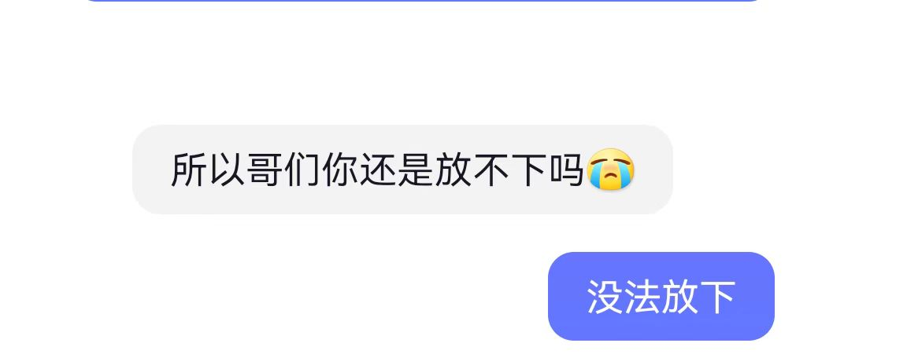
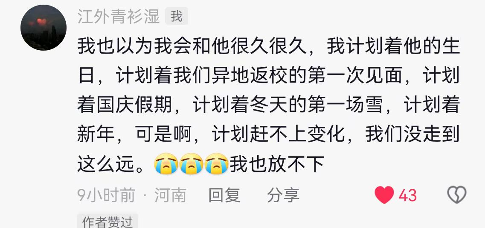
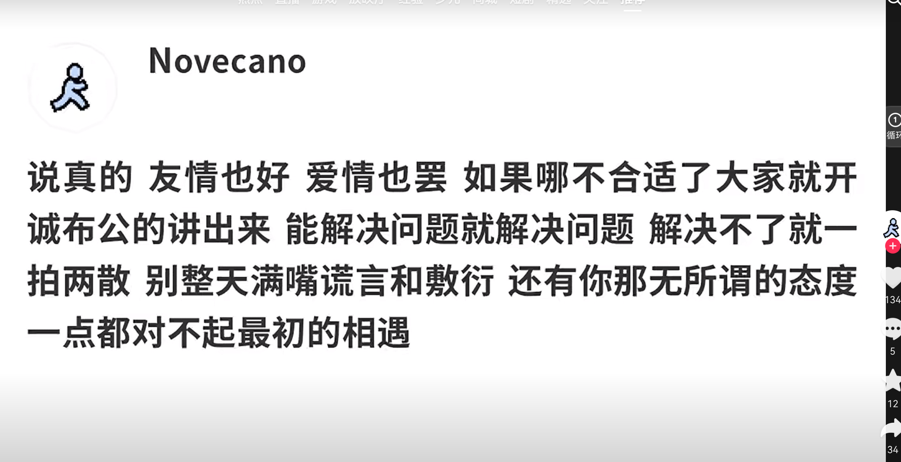
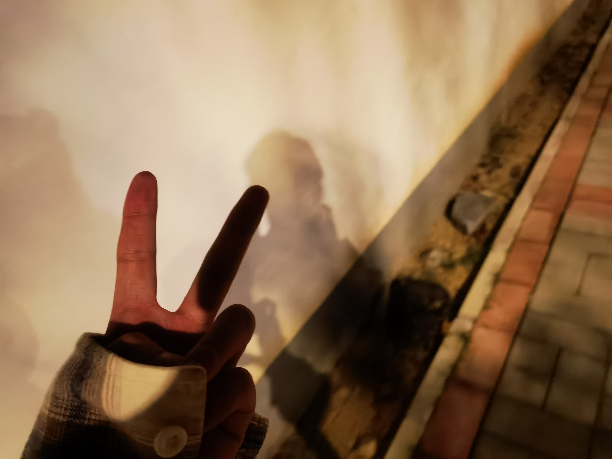
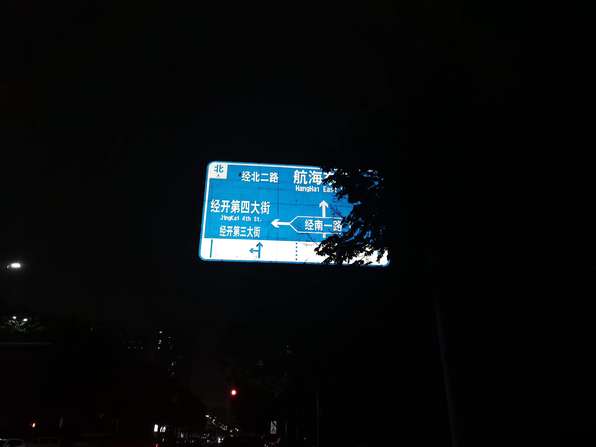
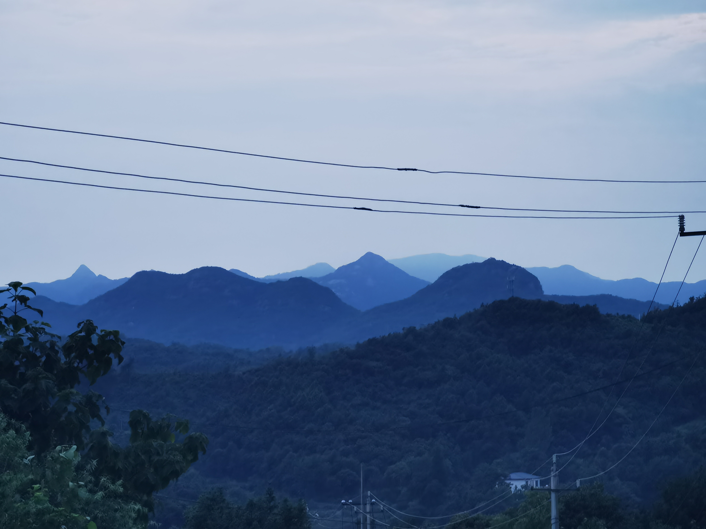

<!-- 本文件已于2024年09月02日更新 -->
我很勇敢，我只殉我的青山

 

[访问原页面请点击](locked.md)

## Star History

   

<!-- ——2024年9月3日

昨天一位陌生网友问了我一个问题，我能放下吗？我也在想我能放下吗，我能释怀吗？

会释怀吗，我想我的答案是不会，永远不会。

也许终有一天，我会和自己和解。咽下所有的脾气，磨平一生的棱角。笑着面对曾经讨厌的人和事，变成一个不动声色的人。在繁华中自律，在落魄中自愈。谋生的路上不抛弃良知，谋爱的路上不抛弃尊严。

可是这是释怀吗，我想这不是，当一切都要考虑后果的时候，我想这不是自由，我会考虑和这个人有没有以后，他是不是真的适合我，我是不是真的喜欢他，可是这些真的是我想要的吗？这真的是谋爱路上我应该学习到的技能吗，我想这不是！

21岁的我对爱情的理解就是“爱不能抵万难，可是相爱可以，爱没有用，相爱才有用”我就是天真的以为，只要爱还在，天大的困难，我们都可以凭借着我们的爱意克服，我就是有着撞死在南墙上的勇气，我就是秉持着“千金难买我愿意的态度”敢在谋爱的路上将一颗真心全部托出，纵使这一条路上有很多阻挠，有很多艰辛，就像我可以蹬40分钟共享单车，跨过两个区，只为见喜欢的人一面，哪怕只是匆匆一面，累吗，好像在看见你了之后就不怎么累了，就像很久之前看到的一句话“这一路的艰辛只为了能见上你一面，可这一路的艰辛在见到你的那一刻就觉得不算什么了，因为爱，因为你，所以这一切都值得，去的时候一路上都在期待，可返程的路上只有孤独，爱这段路聚少离多，山高路远全凭良心”

所以啊，磨平棱角，学会权衡，这不是释怀！我始终相信这个世界上有着朴素的、单纯的、真诚美好的爱，也许在经历这些之后我们会看清一些事情我们也会学会斟酌，考虑，评估，一段感情是否应该继续，可是这是爱嘛，这是真的释怀吗？我想并不是，真正的释怀，应该是不管经历什么我始终坚持着自己对于爱的评估，我始终相信这个世界上有真诚的爱。爱从来不是选择，也不是不合适就分手，腻了就换，而是让人感到温柔和勇敢，是明知不可为而为之的坚定，是因为我爱你了就会一直爱你，我想让你知道我对你的爱不是一时兴起，而是内心深处无数次的心动，是我想跟你一起努力。就像宫崎骏说的：我爱你不是为了搂搂抱抱，而是情不禁自禁的在乎你关心你惦记你想懂你不是因为我执着，而是因为你值得。

可我看不清，我不懂为什么真诚换不来真诚，勇敢也不会有对等的勇敢，两个相爱的人永远会因为小事产生隔阂，承诺永远只有在爱的时候有效，所以我永远不会释怀的，我也放不下，毕竟那是我实打实的爱。

---- -->

<!-- --2024年9月5日

这段时间每天晚上我都会梦见你，哈哈，说来也很奇怪，记忆这个东西就是这么无解，我脑海中你的样子已经慢慢模糊了，就连在梦中我也要很久才能发现，那是你，哈哈是不是很奇怪啊，可是啊，我太想你了，我知道我有很多你的照片，搞怪的，帅气的，甚至还有我们之间的合照，可是我不敢看，对我来说，照片不仅是一段情感的载体，他更是一段记忆的载体，看到那一张一张照片，我就会想起我们在一起发生的事，我怕我更放不下了。

最近每天梦见你的次数越来越多了，你在我梦里的出现的时间也越来越长了，世人常说，如果你梦见一个人三次，你们之间的缘分就断了，我好害怕我们之间也没有缘分了，我也不敢发消息，只有在我实在是忍不住的时候，我才会给你发消息，可是你也不回我，哈哈，我也不知道你看见我的消息，是一种那个什么样的感觉，是不是你会想，这个人怎么这么烦啊，都分手了还给我发消息，哈哈，或许吧

或许吧，或许我的坚持也没什么意义吧，或许这段感情里只有我一个人舍不得，只有我一个人放不下，或许你也不会懂我的委屈，或许你从来就没想过和我长久哈哈，或许吧，也许从一开始就是我错了？或许吧

---- -->

--2024年9月6日

比结束更痛苦的，就是拖泥带水地耗着。说爱吧，耗尽了所有希望，说不爱吧，又在某个瞬间发了疯地想挽回。一边崩溃，一边自愈，反反复复，一边清醒，一边糊涂，一边说放下，一边又无可救药地说想念

别再靠近我了，也别来了解我，我没有你想象中那么好，而且我不喜欢来了又走的人，这样真的很烦。

----

--2024年9月7日

陪伴的人教会你爱，路过的人教会你成长。我不需要一个随时会把我抛弃的人教我长大，以后我的人生中，若不能是坚定的选择我，长久的陪伴我，那就别来了，别说爱我，别说喜欢我，你看人心这么易变，是可以说不爱就不爱的。

你只是出现了一下，可是你不知道，我要花多长时间舔舐伤口。

----

--2024年9月8日

偏偏不懂幸福的人最幸福 反而怀揣着真心的人一直掉眼泪 没有爱的话这一生也太长了 可是有爱的话这一生又太哽咽了

----

--2024年9月9日

后来才明白 活成自己想象中的样子真的很难

----

--2024年9月10日

<!-- <video width="" height="" controls> 
  <source src="https://heyebei-my.sharepoint.com/:v:/g/personal/heyebei_heyebei_onmicrosoft_com/EfN-o2wMbdZNlrVZ-mKhoC0BL-l4HnhCve-_1Qsxj_XAow?e=1hwZCO" type="video/mp4"> 
</video>  -->

[我想我们之间的恩怨也应该就此了结](https://heyebei-my.sharepoint.com/:v:/g/personal/heyebei_heyebei_onmicrosoft_com/EfN-o2wMbdZNlrVZ-mKhoC0BL-l4HnhCve-_1Qsxj_XAow?e=1hwZCO)

----

--2024年9月16日

别哭，千万别哭，马上你就要释怀了！别哭！千万别哭！

----

--2024年9月18日

我承认当他们面对高考的学生来和我谈论情爱的时候，我的第一反应是告诉他们要好好学习专注于高考的那一刻，我才惊觉年少时射出的子弹此刻确实已经正中我的眉心

是啊，偏偏长大两个字孤单到连偏旁都没有

----

--2024年9月20日

心情很好。但总是会在开心的时候突然想起你，我在想应该是想与你分享快乐，但那一刻会突然暗淡下来，为不知所措的生疏。我也曾一度怀疑你的怀疑，不清楚自己所要表达的爱是什么，是爱情？友情？亲情？或许就该像我曾经说过那样:“人与人之间的感情包括但不仅限于友情、亲情、爱情，爱有千百种形态，而我对你便是特别的一种。

我默默的收藏着青春岁月里的秘密，像小孩藏在口袋里的一颗糖，沮丧的时候才会撕开糖纸闻一闻，告诉自己还有明天，还有明天……来日方长！   

 

----

--2024年9月24日

爱是贯穿三万昼夜的伏笔，起始于普罗旺斯的十二世纪，穿过半个行星的流离，也只为在你眼中的氤氲里孕育出柔情。我太执迷不悟了，我不知道该用何种语气表明那满是酸梅味的日记，那陷入两难又冠冕堂皇的道理，连带着稚气未泯都充满了哽咽。

----

--2024年9月24日

读到罗兰巴特的一句经典:过去一直以为我是因为没有得到爱而痛苦，而实际上是因为我以为别人是爱我的而痛苦。

我讨厌已读不回，讨厌没有下文的聊天记录，讨厌敷衍的回答，讨厌不真诚的人。重视是相互的，如果经常敷衍我，我就不想同你讲话了，所以你很忙吗？那么我们就不再讲话了。

----

--2024年10月15日

命运教我独善其身，旧人教我凉薄断情，我是曾被泥流冲垮的堤岸，亦是曾被春天浇融的雪水，不再执着于浩荡江海，不再痴念于隆冬退守，我与我周旋久，我令我过重山。

----

--2024年10月19日

时间的长河消融了许多人。每个生活阶段最好的朋友都不会是一个人，人是会变的，感情是流动的，许久以后你就只剩下你自己

没有了我深爱的光环，有些人原来是那样普通当我意识到这件事时，我开始慌了。或许应该是怎样的失望才会让原本闪闪发光的人和每日擦肩而过的陌生人一样不起眼了?大概是每一次，每一次我努力靠近的失败，每一次滔滔不绝得不到的回应

相遇不一定有结果，但一定有意义，谁也无法代替我记忆里的人，但告别是一条必经路。希望我们都能在这疲惫不堪又无能的日子里，勇往直前，不怕失去。 

----

--2024年10月20日   

享受当下，尽管知道结局，希望你别因为以后的破碎而耽误眼前的美好，也别强求，就像如果坐累了就站起来走一走，太累了拿下眼镜多看看远方。如果有一日回忆起二十来岁的我，那我就永远活在了你二十岁的年纪。 

----

--2024年10月21日

曾经有人告诉我说，要先学会爱自己，我就是挺笨的，总是与自己为敌。
我是破碎的，总渴望有人将我拾起，但我始终只有自己，每当夜晚哭泣时，我就一遍一遍告诉自己明天太阳依旧会升起。

这个世界上最不靠谱的应该就是爱，因为它会变的，爱物也好，爱人也罢。我知道什么好，自己想要什么，如果人们认为对的东西。我没有去得到或完成，那一定是因为我从未看到这些事里有什么好的!

----

--2024年10月22日

我在感情上的愚钝，就像是门窗紧闭的屋子，虽然爱情的脚步在屋前走过来又走过去，而且我也听到了，可我觉得那是路过的脚步，那是走向别人的脚步。直到有一天，这脚步停在了这里，然后门铃响了，而我依然后知后觉，最后，门窗依然紧闭。

----

--2024年10月22日

我只愿意和呆着舒服的人待在一起。什么都不想做，什么都不说，心里是安稳的、放松的，我呆在我的角落里自言自语，我的朋友理解我，包容我，认同我。

----

--2024年10月22日

我平静的接受我爱的人不怎么爱我，或者不爱我这件事，我很难过，但这份难过也让我明白，我更应该好好爱自己。

----

--2024年10月22日

你不是失去了爱的人，你只是撕去了日历中那几页认真和真诚！

----

--2024年10月24日

成长悄无声息，岁月是一面镜子照着过往的点滴，我也不想批判那时候的自己，可是那时的自己实在太丑陋了，所有做的一切很真诚，却让现在的自己可怜，窒息。人不可能每一步都正确，但十八岁的勇气已经用完了

也许日子过着过着就有了答案，也许现在所不能接受的也会在某天释怀。愿往后的日子里，看山看海看落日余晖，好好爱自己，愿我们都能拥有感知细碎幸福的能力!

----

--2024年10月25日   

我知道什么东西好，我知道自己喜欢什么，需要什么，所以当我迟迟不愿意去接受一件事情、一样东西，是因为我太固执了吗?只是因为大部分人觉得我和他们不一样，过着他们得不到的生活，坚持着他们没能坚持的路。真的是为我好吗?《杀死一只知更鸟》中写道:“你永远不可能真正了解一个人，除非你站在他的角度去思考问题.....除非你钻进他的皮肤，像他一样走来走去。道理很简单，但大部分人都见不得别人比自己好。”

突然就释怀了，人生短短几十载，去过自己想过的日子。要独立就不喊苦，要自由就承受孤独。我这有且仅有的一生，向阳而生。你所见即是我，好与坏都是!

----

--2024年10月27日

我从未放弃爱你，只是没有结局的故事只能留在风里，但我仍然会说我庆幸你永远胜过别人!

----

--2024年10月30日

想把心脏拿出来，放在阳光底下晒晒，它被附满悲伤的青苔，连血液都映射着苍白。究竟要怎样去释怀，面朝大海，还是春暖花开，或是等上几次冰雪覆盖，才能让遗忘显得并不那么草率。

----

--2024年10月31日

看脱口秀决赛，付航说:“你的剧本里根本没有我，所以我悟了，我的剧本里我才是主角，以后身边所有人对我说这话时，我就:嘿嘿，你杀青了，在我的剧本里，你 杀青了!!

学会翻篇，学会放下，学会接受，这都是非常重要的能力。没有必要抓住一件事、一个人不放，也没有必要对某件事、某句话耿耿于怀，别把自己困在某件事里，勇敢的往前走，总有一天你回不值得头看，会发现有些人有些事也不过如此，你掉眼泪。

我想起曾经一位朋友说“你可以很爱一个人的同时，去爱另一个人，这并不冲突。”所以很爱一个人的同时，依然可以和她说再见，或许你依然会想念，但值得庆幸的是她不会再出现在你的生活里，不会再让你总是那么难过。付航的话告诉我，不要把除了自己以外的任何人或事作为精神寄托，任何形式的存在都是有保质期的。希望你永远置顶自己的感受，永远做真诚的人。即使被辜负也没关系，只能说不是所有的人都配得上你的真诚，时间会筛选一切，你只要勇敢最后总有人留在你身边。

----

--2024年11月2日

那些最美好的年华以及真诚的去爱一个人，都像一阵大风，没有了任何踪迹。对于我的青春，我无法给予任何定义。它如初春的花般小心翼翼又如秋天的落叶没有生机，它没有给我太多回忆，除了痛苦，但此刻回想起来却又是那样深刻。我常常幻想回到那时，帮帮曾经的自己，去做出正确的选择，但人啊，无法同时拥有青春和对青春深刻的感悟。

我们就像万千雨点，虽然生命的过程短暂，但记忆的洪流却会携带着曾经的我们，走向远方!

----

--2024年11月8日

如果你对某一件事的结束感到悲伤 那就说明这件事情的过程一定很美好  如果你足够勇敢  让自己用更广阔的视角 看待一切 你就会发现结局未必悲伤 那只是意味着 下一件美好的事情即将开始

----

--2024年11月9日

人的一生应该是万里河山，有无数个往来的过客。有人给山添色，有人使日月无光，有人带来江流，有人带走四季。人生漫长，愿你半生所求，终成枕边月色！   

----

--2024年11月10日

“我总以为度过了眼前的障碍就会迎来新的生活，很多年以后我终于明白，这些障碍就是我的生活。”

----

--2024年11月11日

这世间的面总是见一面少一面，人与人相遇后，好像总会有随时走向分别的时刻，我常常说离别是常态，可没有谁喜欢离别的滋味。也许某一个冬天我抬头惊喜的发现下雪了，却发现早已与你离别，无法与你分享。很多时候，心就像是一个计时器，它不需要依靠任何工具就可以把曾经说过的话，走过的日子记得一清二楚，所以痛觉才会那样清晰。

----

--2024年11月11日

你太固执了，你总是说以前，但是你忘了人都是会变的

----

--2024年11月13日

你渴望得到太多，却总被一些人，一些事强迫留在原地，甚至开始后退，你也挣扎过，你痛苦的流泪却始终一言不发。所以我向往的自由，是付出百倍千倍的枷锁也未必能得到的东西！

----

--2024年11月15日

祝我得太阳照拂，一如荒野疯长的草，长成如愿的自己。

----

--2024年11月19日

任何一种环境或一个人，初次见面就预感到离别的隐痛时，你必定爱上他！

——黄永玉《沿着塞纳河到翡冷翠》

----

--2024年11月19日

对于某系统而言，只要经过充分长，但有限的时间，一定会返回初始态本身，于是在宇宙中，每个粒子都在经历无尽循环，等待回归最初的轨迹。

——庞加莱回归

----

--2024年11月20日

我不怕因为我缓慢的抉择，而失去一个可能很好的人

爱情又不是我的全部

----

--2024年11月25日

后来我发现，我失去的每一份月亮都是我该失去的，此去经年，山是山，我是我，明知不可为而为之，是我最大的诚意

后来我发现，我错过的每一颗星辰，都是我该错过的，物换星移，路是路，我是我，明知不可得仍追寻，是我最深的执着

----

--2024年11月28日

我是一个很需要被爱的人，所以我也很用心的爱着别人。我在期待着他们温柔且有力的爱回来，但我的期待总是扑空。

----

--2024年12月3日

《百年孤独》里有一句话:比起有人左右的日子，我更喜欢无人问津的时光。其实独处并不是孤独，是让人把心腾出足够的位置，在内心深处遇到最真的自己。人到中年要求都变得很高，如果达不到不如不要，我太知道自己想要什么了，我也知道什么能满足自己，只是合适的太难。人生中大多事不由己，所以修一颗平常心去面对得失

----
<!-- --

---- -->

<!-- 我释怀不了，那是我实打实的爱啊 -->