 

希望有一天有人也会告诉我这里的一切他都看过

---2024年05月26日

 
 

**2024年04月13日**  

我喜欢  
酒  
夏天  
十六天的月亮  
凤里翻滚的麦浪  
你做的糖渍杨梅  
你穿白衬衫  
你我  
你

[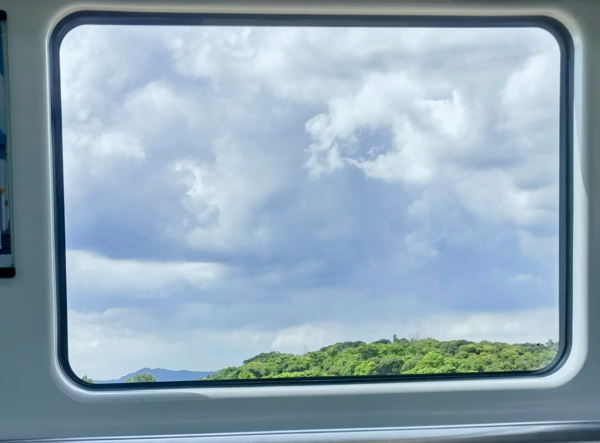](https://heyebei-my.sharepoint.com/:i:/g/personal/heyebei_heyebei_onmicrosoft_com/EYPP6JLMuyVOvI8V9lp1ZPQBt9vJHCfgh7JaSZGjlfxdyQ?e=hYGmak)

---
**2024年04月13日**   

见过花开就好了，又何必在乎花属于谁  
莫负春光，莫负良辰  
愿余生快意，若不能，便万事如意  

[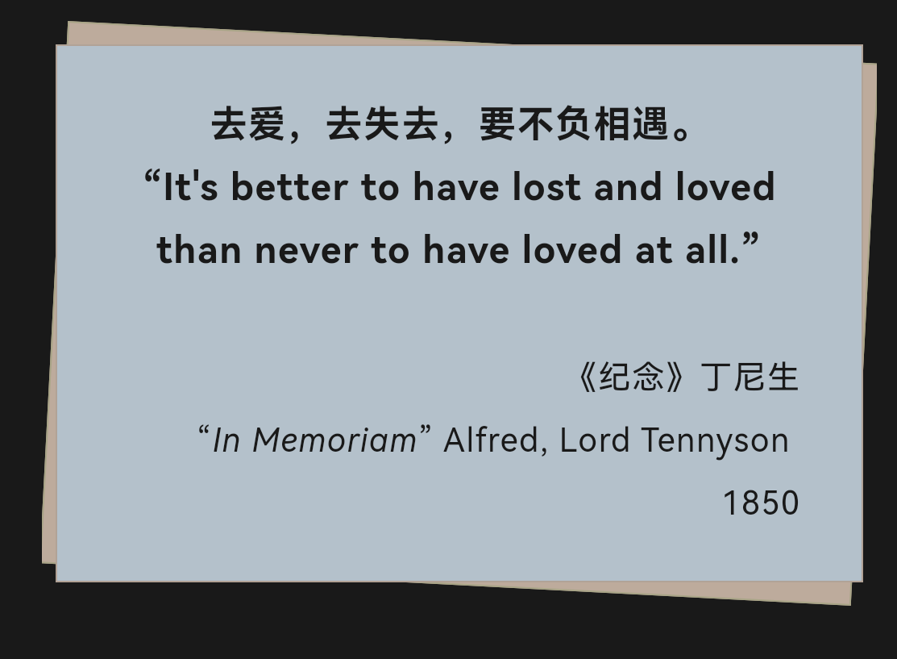](https://heyebei-my.sharepoint.com/:i:/g/personal/heyebei_heyebei_onmicrosoft_com/EVrXcPXV6-pFg8S-5zApE_QBbHBj3vIn8lVyrtW5bnqJbA?e=kwC2oh)

---

**2024年04月14日**  

做自己就好了  
爱你的人会一直选择你的  
这次  
下次  
次次

[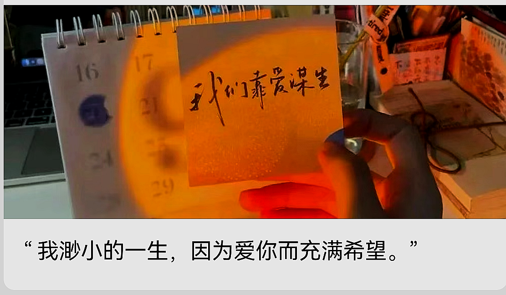](https://heyebei-my.sharepoint.com/:i:/g/personal/heyebei_heyebei_onmicrosoft_com/EdW2alocKKNElwMRRU5l2qwBc8B2464BO2-W6F0rDl5ayg?e=dfdsLC)

---

**2024年04月14日**  

少年总是东顾西盼，步履匆忙，从来不去想自己真正想要的是什么  
可待近年消逝，再回首望，才发现那些想要的东西早已经擦肩于咫尺  

[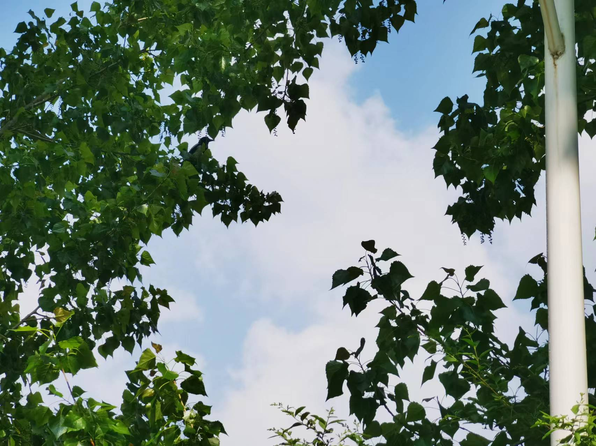](https://heyebei-my.sharepoint.com/:i:/g/personal/heyebei_heyebei_onmicrosoft_com/EZVDq3Sd_bpIuDGyTh2oL10BhXe29_o7XcxJhON8SoEUbQ?e=EI2gcA)

---

**2024年04月14日**  

要一百个春天身死，蝴蝶才会忘却相思  
愿枯木重生便是永生，愿你我相逢，便会永恒  

---

**2024年04月15日**  

人生不可能每一步都是正确的，选错了就选错了呗，不要一遍一遍的后悔，也不要总是责怪以前自己，因为当时你也在雾里，也很迷茫，所以不必回头看，蔷薇谢了明年还会再开，总会有人陪你看不同的风景，开心点！向前看，别回头。  

[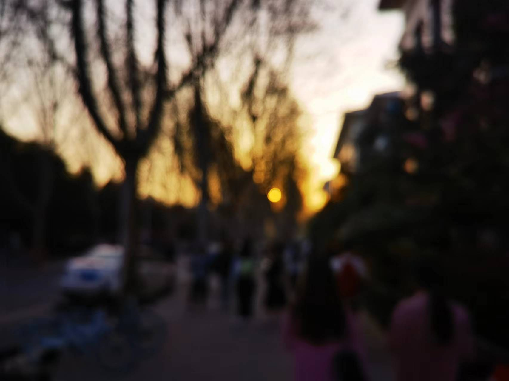](https://heyebei-my.sharepoint.com/:i:/g/personal/heyebei_heyebei_onmicrosoft_com/ERImSOxxwdtJvxKWr-TWPR0BbwZMPnKLbkq7RWPhosZwog?e=6gLmGh)
<!-- [别遗憾 往前走 别回头](video/2024042702.mp4)    -->
[别遗憾 往前走 别回头](https://heyebei-my.sharepoint.com/:v:/g/personal/heyebei_heyebei_onmicrosoft_com/Eey0eQiPIFJKl6_1PH9aKIIBD-tVwv9zdROc3g3HJ53mkA?e=dgdgse)

---

**2024年04月15日**  

樱花树下站谁都美  
我的爱给谁都热烈  
不是你好  
是我好  

[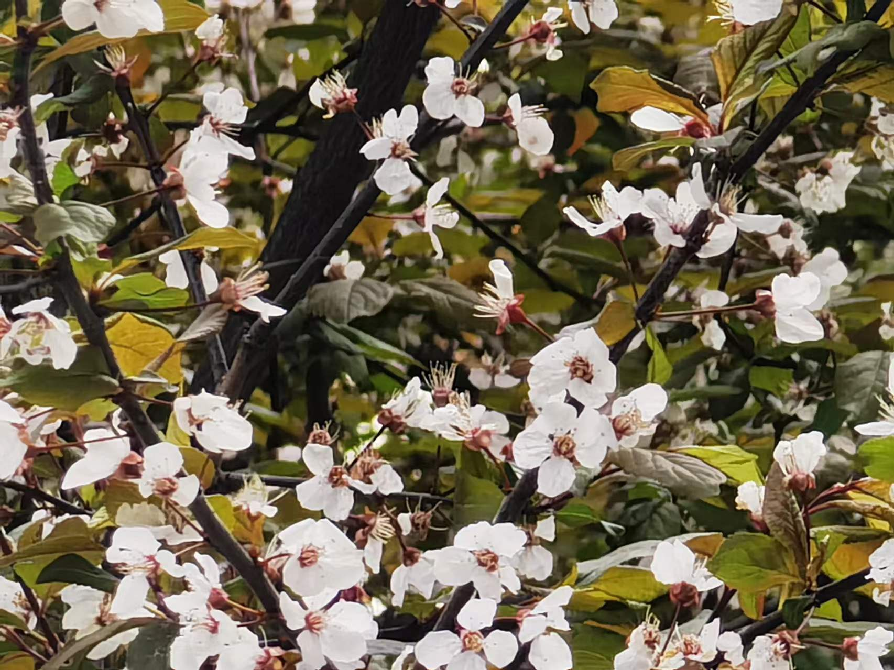](https://heyebei-my.sharepoint.com/:i:/g/personal/heyebei_heyebei_onmicrosoft_com/EX9BN9QZzg5FiEYkebCdEvYBwN_dFW1D-IT-hpOA_1xl7w?e=fR5kYH)

---

**2024年04月15日**  

我曾以为，我会在某一天遇到一个特别的人，然后，我就会放下所有的事情，去爱他。  

[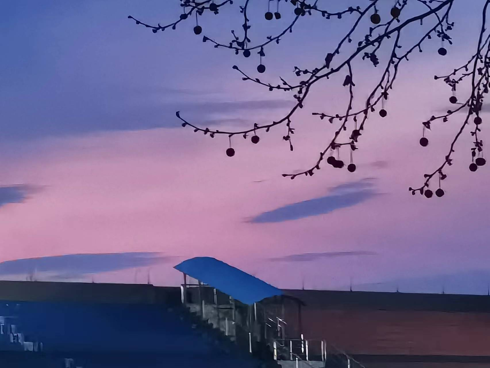](https://heyebei-my.sharepoint.com/:i:/g/personal/heyebei_heyebei_onmicrosoft_com/EUoZghg5bA9IirwS2nBAWZoBHF_Eh40-GsCshH4AXYGurA?e=ws2rSj)

---

**2024年04月15日**  

人生无论怎么选都会有遗憾  
但人们总认为  
没有走的那条路上开满鲜花  
希望你永远是为自己而活  
而并非取悦他人   

  

---

**2024年04月15日**  

当你开始真正爱自己，你就会睡得越来越早，也会越来越喜欢锻炼，也不再焦虑和纠结  
变得自信满满的去追求有意义的人和事，并为之燃烧自己的热情，这时候才发现人生刚刚开始  
把时间分给睡眠，分给书籍，分给运动，分给花鸟树木山川湖海，分给你对这个世界的热爱，而不是浪费在无聊的人和事上  

[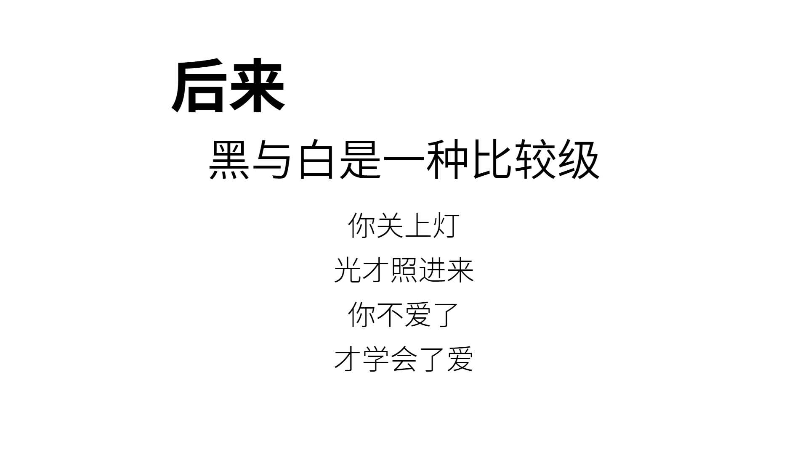](https://heyebei-my.sharepoint.com/:i:/g/personal/heyebei_heyebei_onmicrosoft_com/Ec4HbpnfAP5BvjbqNbUUswMB2IgSAEKk4DXXn983YL3-Fw?e=7m2SYj)

---

**2024年04月17日**  
<!-- 还记得那句台词:“如果一个人不打电话给你，那她是真的不想给你打电话，如果一个人对你好像不在乎，那就是真的不在乎，毫无例外。”    -->
<!-- 可惜，现实中是很多人总把自己当成例外，以为总会感动一个人，以为随口而出的话就是诺言。打败这一切的是细节，是感受，是态度。我们总要大方但承认自己太普通，不会成为例外。  -->  
**时间不会永远停留在过去，你也不能只活在那一刻。**     

[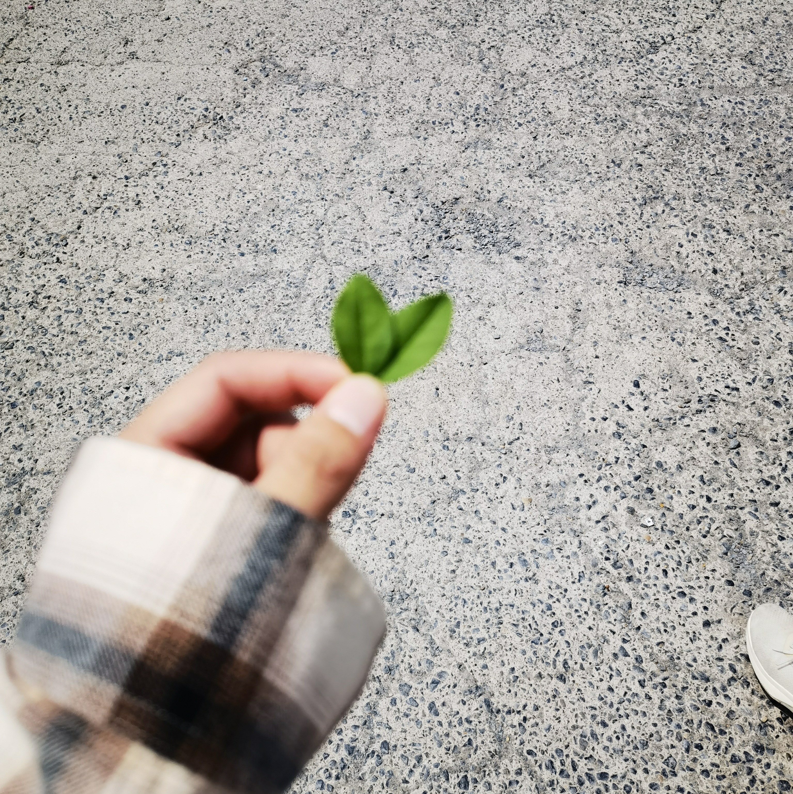](https://heyebei-my.sharepoint.com/:i:/g/personal/heyebei_heyebei_onmicrosoft_com/EQ24ZcwISMxFi35KFxzCxfYBfHn8sv2FiJZEdstpLRJ3Aw?e=Kt3Atg) 

---

**2024年04月20日**  

你说，你舍不得的东西最后还是丢了，后来终于在漫长的岁月中取而代之。  
你说，你经过了那个花园第一眼看到的那朵花很耀眼，逛了整个花园你却记不起它的容颜。  
你说，你心中有一道鸿沟，最后岁月抚平，终于得到了治愈。  
你说，你遇到的人身上都有她的缩影，你惴惴不安，怦然心动。  
你说，时间总是不对，是哪里不对？人还是事？你说不用追求事物，应追求于本心，本就没有坚定的被选择，又何来对错。  
<!-- 变化这个东西太奇怪了，你形容不出来，但你就是知道一切已经不一样了。很多人在情绪不稳定时，会通过表达爱意来替代表达沮丧。如果你的朋友突然向你表达了爱意和思念，多半是她被情绪击溃了，所以才向你靠拢，此刻她正在坠落，而你可能是她唯一信赖的人。   -->

[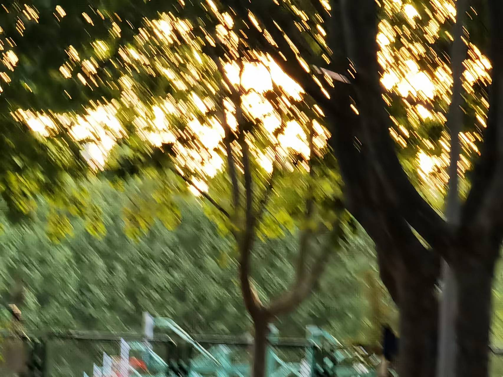](https://heyebei-my.sharepoint.com/:i:/g/personal/heyebei_heyebei_onmicrosoft_com/EchepK7xLRBIiaXIJ2oSc2sBzhAGImdQ4mTbI9jXzfZxLQ?e=w3mKnQ)

----

**2024年04月24日**  

在我这一生里，有好多奢望。想被爱，想开朗，想成为千变万化的云，只是风截停了我的去路，最终我什么也不是，什么也没有。如此回首，这人间风雨只剩下猝不及防，后来我发现，越是简单的东西越难得。  

[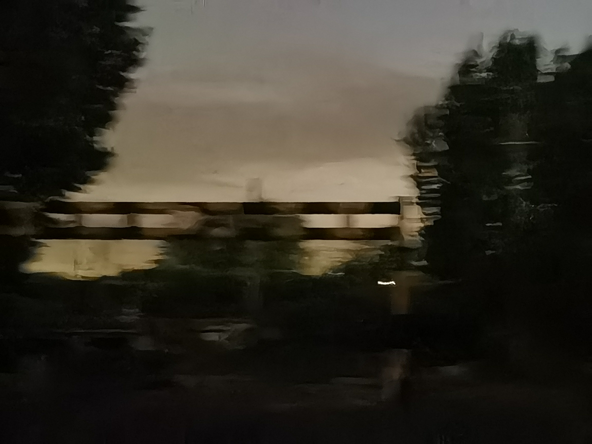](https://heyebei-my.sharepoint.com/:i:/g/personal/heyebei_heyebei_onmicrosoft_com/ET6tYrqXX55Cs9K3F4nu7ZcBj9a8MfSUAlkUspgWUnt30w?e=UMwHTp) 

---

**2024年04月24日**  

他教会了我不爱了就是不爱了，没有为什么，当你卑微的去挽留的时候，他不会有半点可怜你，那只是自己作践自己，说过的话可以不算，爱过的人可以再换，爱别人的前提是先学会好好爱自己。爱太满，最后伤得深的只有自己。爱情死了，但你得活！人这一生本就是不断的遇见，不断的错过，时间总会让人放下过往，无论他在你心里下过多大的雪，都要收拾收拾，然后奔像春天。      
一段感情中最心酸的事便是：对方已经决定跟你分手了，只是还没想好充分的理由，而你却还在计划着两个人的下一步。然而更心酸的是，在你发现这个事实之前，你还在懊恼，还以为是自己没有更好的珍惜。  

[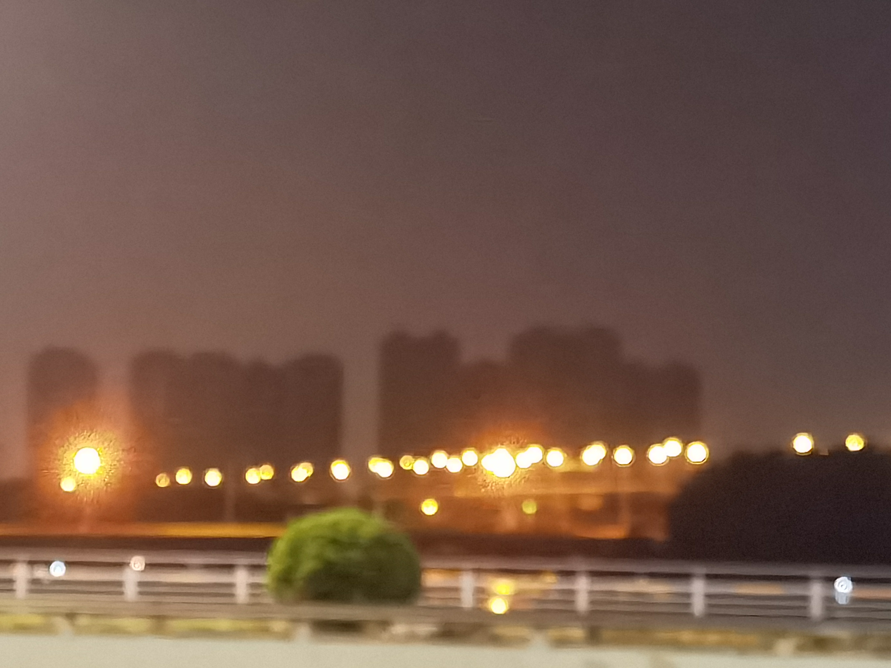](https://heyebei-my.sharepoint.com/:i:/g/personal/heyebei_heyebei_onmicrosoft_com/ETHMjNs-zyNOjgkjtF9zoVEBZ15nob8kYJP5JUR_ZQGcNQ?e=IU5UJT)

---

**2024年04月24日**  

你是否能接受我们渐行渐远。我的青春是一场盛大的别离，好友便是先走散的人，无论曾经许下什么样的誓言，只要时间的风吹过，我们便从陌生走向了陌生……  
有些想念，像十除以三  

[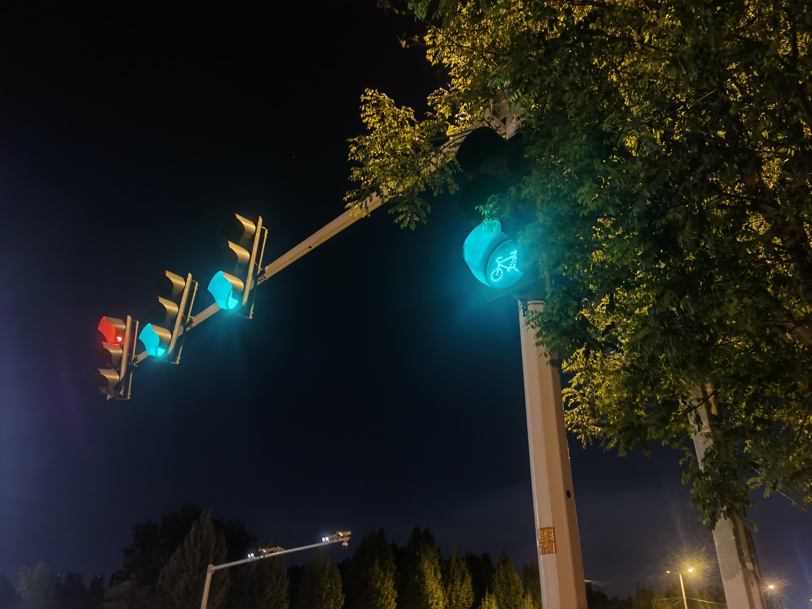](https://heyebei-my.sharepoint.com/:i:/g/personal/heyebei_heyebei_onmicrosoft_com/ETUekvmlFThNhloGbHxnT18BjxVjmvzRGN1D64hSGnlbtg?e=Jl6btK)

---

**2024年04月25日**  

村上春树说。其实你不需要去纠结要不要断掉某一段关系，不要费那个劲挣扎了。因为你的一切看似是你在选择，其实都是命中注定的，双向奔赴的爱情，是当你想奋不顾身地为一个人的时候，对方恰巧也在热烈的回应你。你要相信世界上总有一个人愿意用最朴素的方式爱你。不是撩你，也不是套路你，就是那种单纯的想对你好。也只对你好。   
不要着急去找一个答案，答案不重要，如果这段姻缘没有尽，你是结束不了的，当有一天，你的磁场开始变得强大，你生命中那些和你不匹配的人或事，都会通通自动的远离你。   
所以你只管成长你自己，你只需要去超越他，那个时候，你就会发现自己的内心强大了，他在与不在，其实都一样，你要知道，自信才有资格谈浪漫，收起你那多余的自卑，把皮肤养好，把身材锻炼起来，多读书，腹有诗书气自华。你自然明白人间难得，不是所有的鱼都生活在同一片海里，我们来自不同的地方，不同的圈子就有不同的生活，生活是自己的，你想怎么过就怎么过。永远不需要向任何人交代，不需要把自己框在固定的架子里，在任何的关系里，过度的解释都会让人感到心力憔悴，所以才会有那么多的人，大家都渴望遇到志同道合、心有灵犀的朋友和爱人，那些会懂你的人，是因为他们在意你，很喜欢杨绛女士的这句 *“最高贵的惩罚是沉默，最矜持的报复是无视”* 少在烂事上纠缠，少为不值得的人生气，让自己活得更贵一点，学会放下，才能更好的前行，这个世界看似纷繁复杂，本质上还是你一个人的世界，这世间有太多的猝不及防，有些东西根本不配占有你的情绪，人生就是一场体验，请你尽兴吧，如果别人说你两句。你就受不了被干扰的吃不好睡不好，你得有多脆弱，你要明白，能干扰你的往往是自己的太在意，能伤害你的往往是自己的想不开，你若平和，无人能扰，所以不要过于敏感，内心要不断的强大，别被别人左右你的情绪，有心者，有所累，无心者，无所谓。   
做一个内心强大的人，走自己的路，让别人说去吧。   

[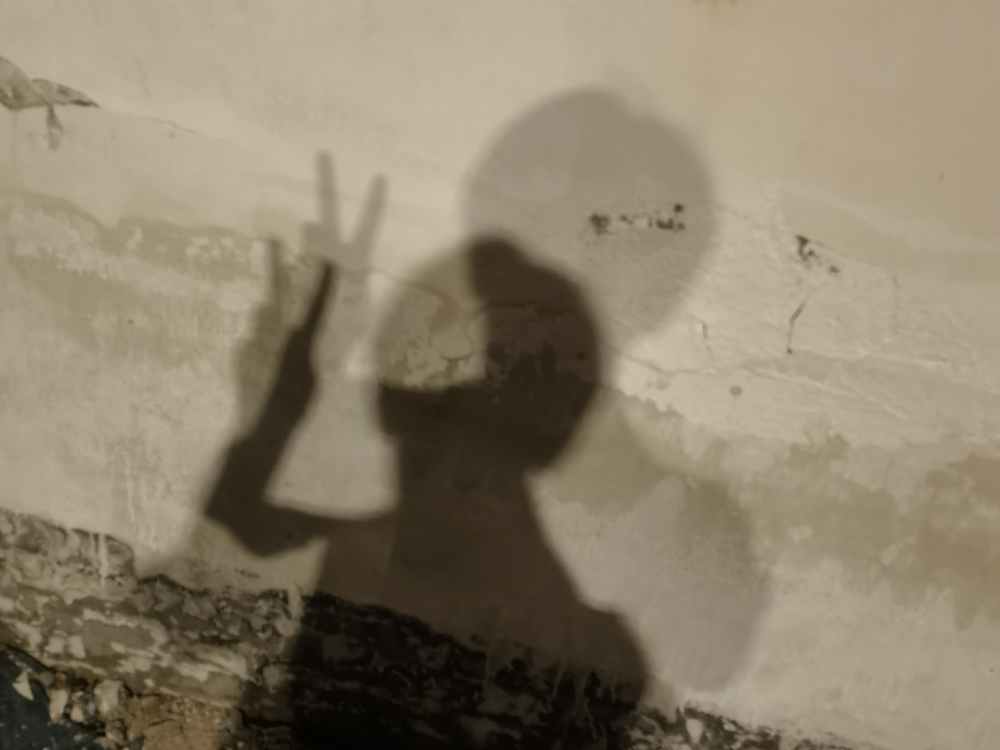](https://heyebei-my.sharepoint.com/:i:/g/personal/heyebei_heyebei_onmicrosoft_com/EfxFgwvYFBxAq5KgUus8sN0BS5_Kej5bM8jAzKsJl_dZDg?e=5Z9BEe)  

---
**2024年04月26日**  

你永远无法知道某一个瞬间在你人生中的意义   
可能很多年之后，你还是会回想起那一个瞬间，还是会想起那个人   
时间的长河奔流不息，往后你的人生中，每一个人都像他，但是你知道每一个人都不是他   

  

----

**2024年04月26日**  

你习惯说 “我没事，不用管我。”然后呢，每次都会收获一句 “那你自己小心点。”突然有个人对你说 “我不管你可怎么行。”这时候，你的心被砸的稀软，所以呢，别着急，总会有人拿着鲜花，满心欢喜的朝你走来。   

[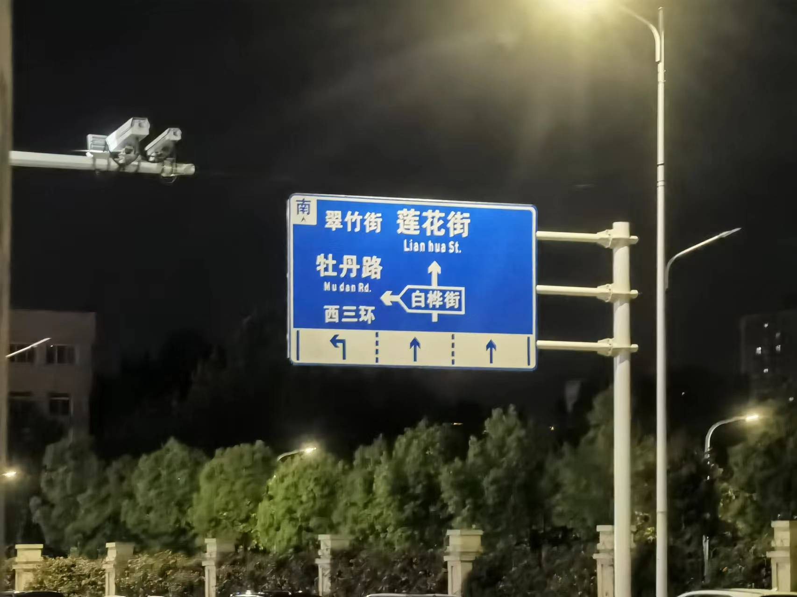](https://heyebei-my.sharepoint.com/:i:/g/personal/heyebei_heyebei_onmicrosoft_com/Ec8YtrT0yalFirEasYqq1gkBnnoK_MD2wEOk3jsKU49uJw?e=lRc5R3) 

[你要是足够了解我 肯定会厌弃我的](https://heyebei-my.sharepoint.com/:v:/g/personal/heyebei_heyebei_onmicrosoft_com/Ebg08QzOM7tIjutdRnmfDpgBMmaWIaKs05_wCBVLU4C7rA?e=E6lJsp)
<!-- <video width="" height="" controls> 
  <source src="video/你要是足够了解我 肯定会厌弃我的.mp4" type="video/mp4"> 
</video>  -->

---

**2024年04月27日**   

亲爱的，你知道吗，我本可以义无反顾奔向我爱的人，可你对我的态度，我又怎么敢义无反顾的奔向你呢。不是不爱，而是你给我的感觉就是如果我义无反顾奔向你的话，我会输的一败涂地   

[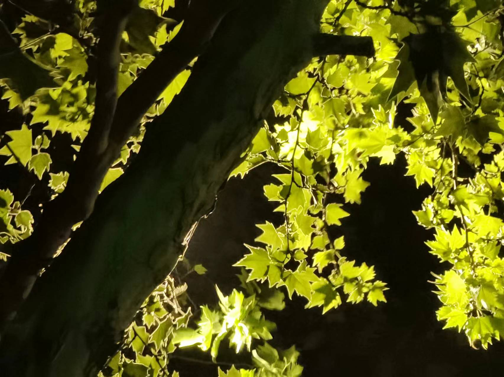](https://heyebei-my.sharepoint.com/:i:/g/personal/heyebei_heyebei_onmicrosoft_com/EcDKfNtKbMJKjhhxxI8gdskBzwZzH8hP40O3a37wn2CcZg?e=i8P7wh)    

[Forever and always](https://heyebei-my.sharepoint.com/:u:/g/personal/heyebei_heyebei_onmicrosoft_com/EWc5tm57o0hCtSknkG_E5AQBE2V02CP6cmEasqpDieXZVg?e=khl9tm)

<!-- ​<audio id="audio" controls="" preload="none">
      <source id="mp3" src="https://heyebei-my.sharepoint.com/:u:/g/personal/heyebei_heyebei_onmicrosoft_com/EWc5tm57o0hCtSknkG_E5AQBE2V02CP6cmEasqpDieXZVg?e=khl9tm">
</audio> -->

----

**2024年04月27日**    

喜欢没什么了不起，被坚定选择才值得。慢慢来是一种诚意，我也喜欢慢一点的关系。   

[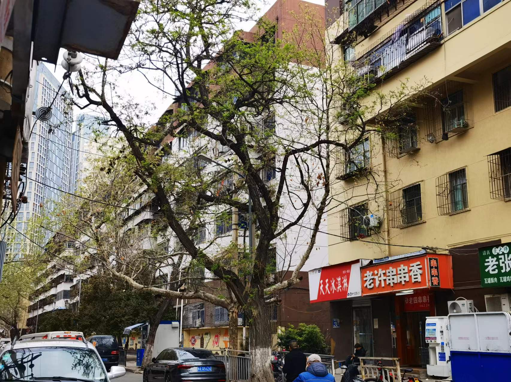](https://heyebei-my.sharepoint.com/:i:/g/personal/heyebei_heyebei_onmicrosoft_com/Edil3J4mcWBPq8SnRXqsINsBUNClYDh2u7Mg9lXP-cSkiw?e=dCgvvu)

----

**2024年04月27日**    

同频是一种暂时性的状态，是会变化的，但爱不是状态，爱是一种调频的能力。    

[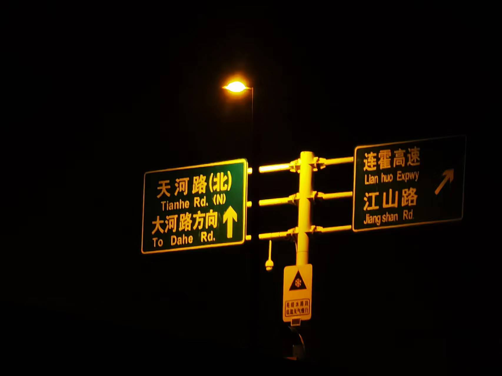](https://heyebei-my.sharepoint.com/:i:/g/personal/heyebei_heyebei_onmicrosoft_com/EaCHBKXdwzVLpVYOsX-rjjABq68WyZnaIjqyZGnecUVfKw?e=P8qf9K)

----
**2024年04月28日**     

我一直强行把一些东西送给你。我的时间，我的爱，我的矛盾，我的狰狞和假装乐观。我从没问过你想不想要，我只知道这些我从不给别人。     
我以为真正的真诚是，我可以在你面前不用伪装，可是后来发现，必杀技从来不是真诚，而是想象力，当现实的我不能满足你的预期，那么真诚只会是你的负担。   

[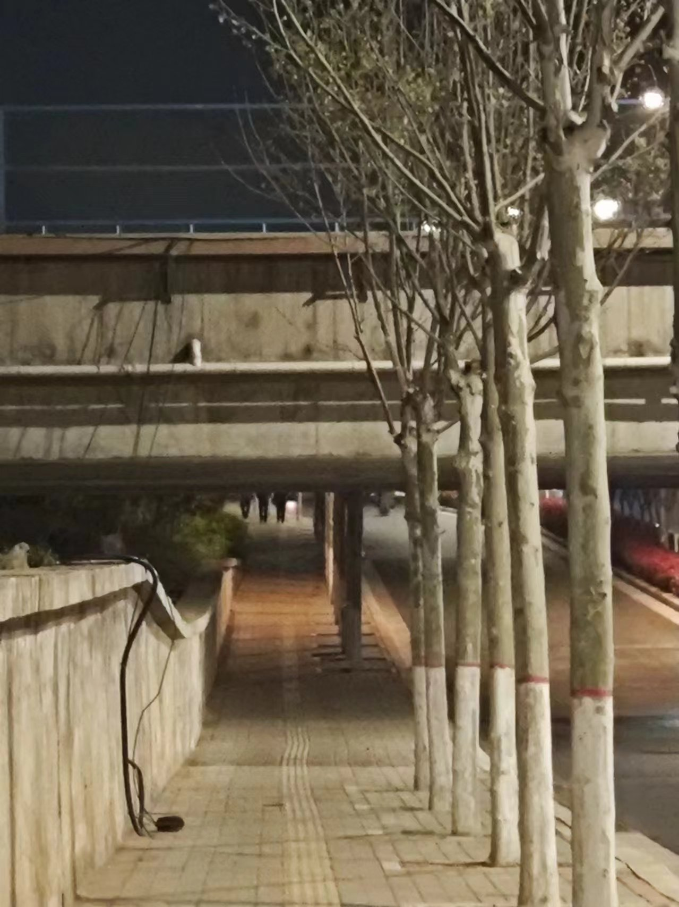](https://heyebei-my.sharepoint.com/:i:/g/personal/heyebei_heyebei_onmicrosoft_com/ERS83wvnV51Pv7-W3Dbg7tkBT_9D-ngRnuuVXJOhn16QUQ?e=8dzTr0)   

----

**2024年04月30日**    

真的没关系的，大家都会爱错人，会莫名其妙掉眼泪，走在路上突然会崩溃，但不妨碍我们去看看晚霞吹吹风，都会过去的
大大方方结束一段失败的关系，是我们成长路上的必修课，不要再去纠结那些已经发生的事和那些烂掉的关系，最糟糕的并不是你失去了一个很爱的人，而是你为了一个不值得的人失去了自己    
你依然很可爱的，不要忘了那个值得被好好对待的自己    

[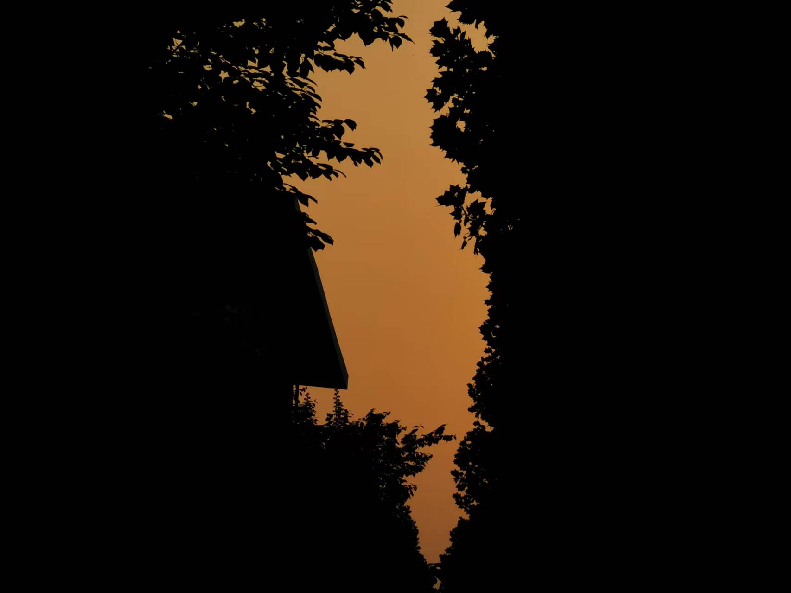](https://heyebei-my.sharepoint.com/:i:/g/personal/heyebei_heyebei_onmicrosoft_com/EStWzd5f84dKs4DJICyonFIBjlLLEkvbhVNmhX1ymHXRkA?e=CqA1Jm)

----

**2024年04月30日**    

最近很喜欢的一句话：      
山海自有归期，风雨自有相逢，意难平终将和解，万事终将如意。    
你来联系我，我就听你说，你不联系我，我就顺其自然，时不相瞒其实我很想你，但问题不大，还能克制。    
我有本事爱你，就有本事压在心里，扛得住就扛，扛不住就死扛，大不了就捂在被子里哭一场。    
喜欢就够了，还能联系上就够了。彼此心里待过就够了，在不在一起真的不重要了。    
祝不了你幸福，那就祝你平安吧。    

[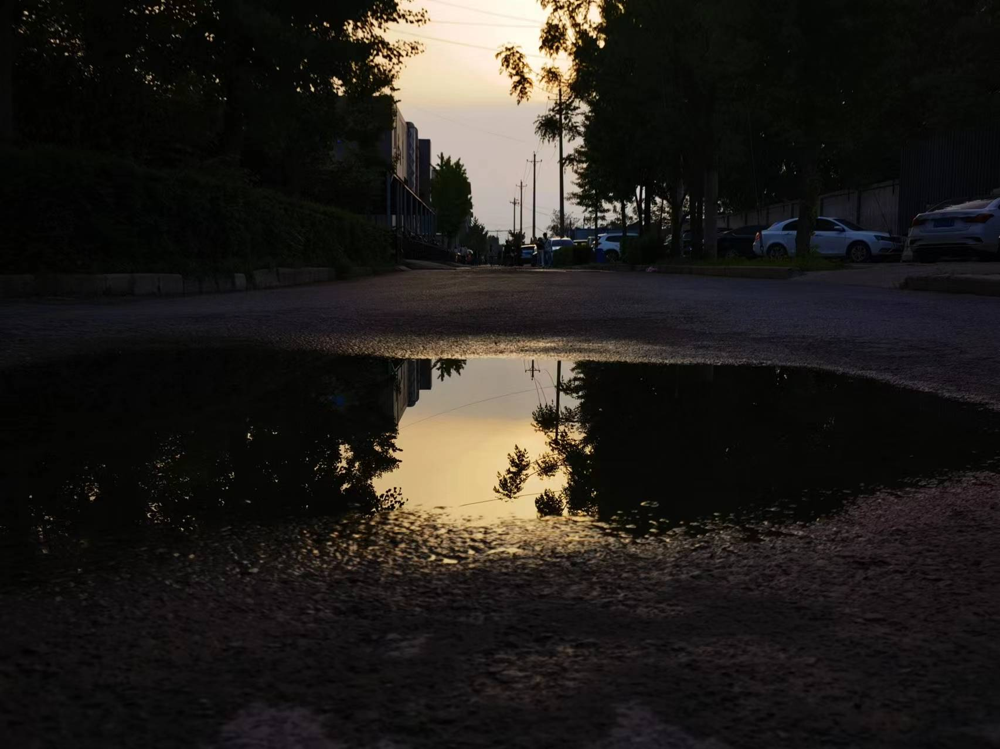](https://heyebei-my.sharepoint.com/:i:/g/personal/heyebei_heyebei_onmicrosoft_com/EfZTEmaGCjdGiNFQqwPQ_XUBDfVxQPQCyz6NceOMrBOQsg?e=fa9xhS)

----
**2024年04月30日**  

感情的世界里，喜欢没用，相互喜欢才有用。   
主动不一定喜欢，不主动，一定不喜欢。   

[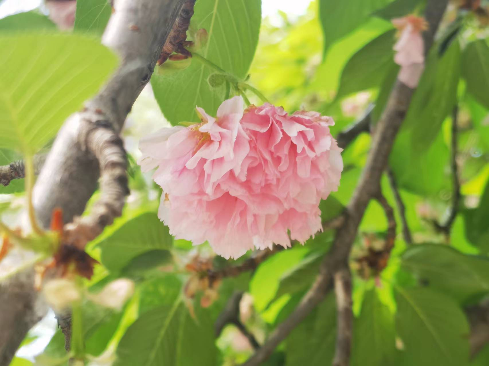](https://heyebei-my.sharepoint.com/:i:/g/personal/heyebei_heyebei_onmicrosoft_com/Ea5i5upYBmhFnZLLLMa9A3AB8t8XU6sQa0ogi8X7gnFdyw?e=IeIFfP)

----

**2024年05月01日**   

不要试图在任何人身上   
去找安全感和归属感   
六点半的早餐和半夜的夜宵   
都可以自己吃   
玫瑰也可以自己买   
夜晚一个人睡更踏实   
心疼你的人   
永远都不会嫌弃你   
想念你的人   
永远比你主动   
永远不舍得让你难过   
不要问爱是什么   
情出自愿就是最好的答案   
而出现在你生命中的人都不是偶然   
他们最终会教会你   
情深不及久伴   
厚爱无需多言   

[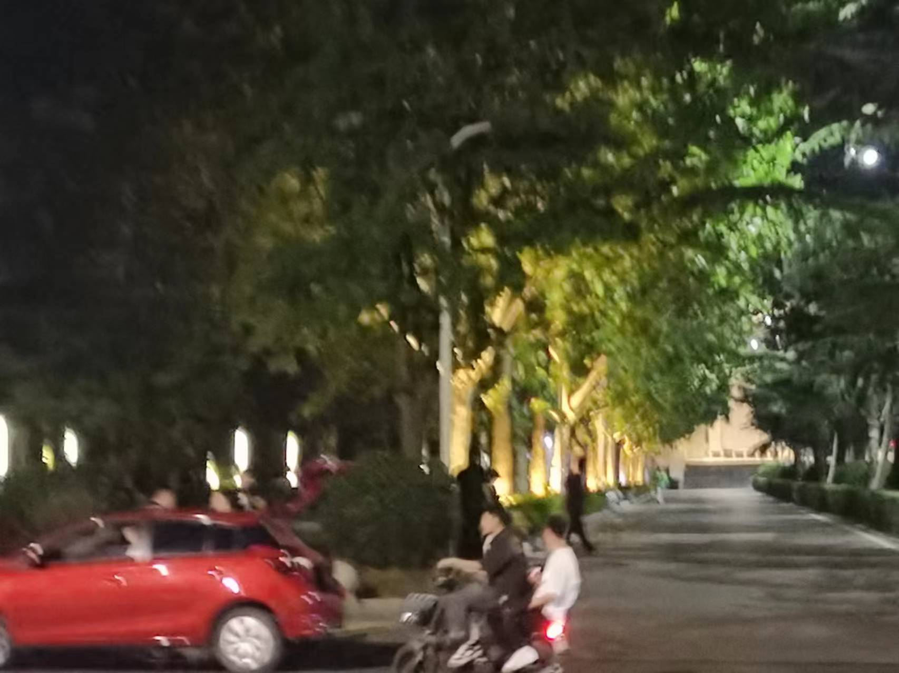](https://heyebei-my.sharepoint.com/:i:/g/personal/heyebei_heyebei_onmicrosoft_com/ETMYxGspM8tAnk4EO4rn6sEBQiucUPH1He1pIl0l0lNXkw?e=1hRK5m)

[番外-20240501](https://heyebei-my.sharepoint.com/:v:/g/personal/heyebei_heyebei_onmicrosoft_com/ERS5qg2QIC5KqrxrbkSLCkUBLrp5LbM3_Mwy2MBG9Tnf-Q?e=ryJC6Y)
----

**2024年05月01日**   

躺在床上发现了一个无解的问题，当你和一个人建立情侣关系，就会对对方产生期待，但对方却不一定能满足你所有期待，那么你就会因为失望产生负面情绪。三番五次，消解的办法就是降低期待。可是如果没了期待，某种程度上就失去了伴侣的意义。   
这是一个死循环。   

[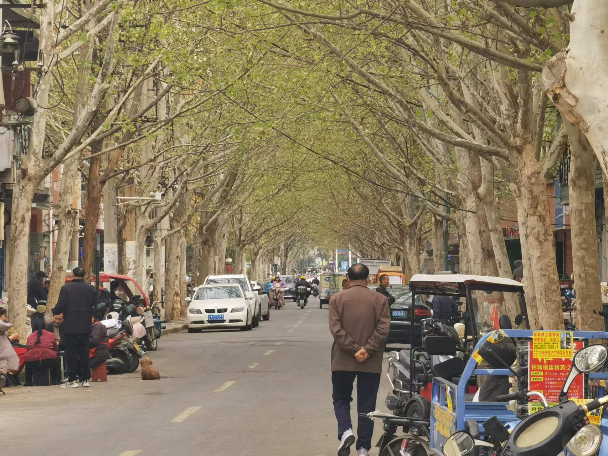](https://heyebei-my.sharepoint.com/:i:/g/personal/heyebei_heyebei_onmicrosoft_com/EZryWBMzldxOqSc6uCL89fkB6JBSSFksBKIPmTftsMWThQ?e=GTQ3vZ)

----

**2024年05月03日**   

后来才知道   
很多故事的结局并不完美   
我内心里期待的爱情   
应当是双向奔赴的   
可现实中 大多是一厢情愿   
情到深处不能自抑   
相思至极不由己身   
明知前方是深渊却还是义无反顾   
等到遍体鳞伤才明白   
偏爱只是例外 遗憾才是常态    

[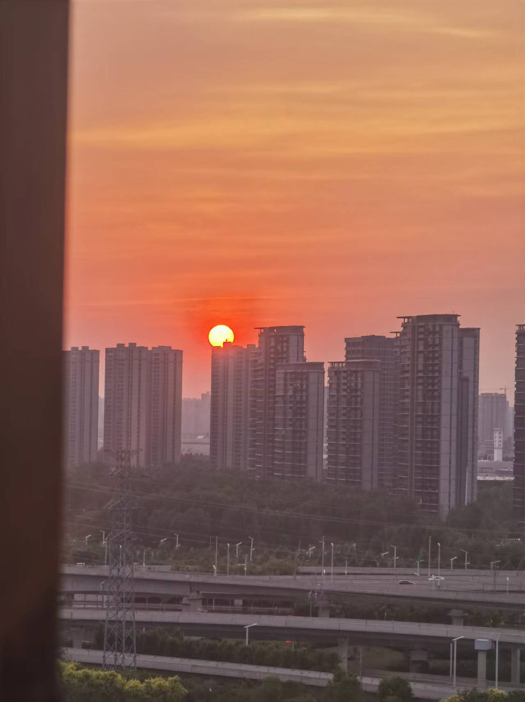](https://heyebei-my.sharepoint.com/:i:/g/personal/heyebei_heyebei_onmicrosoft_com/Edp_zKv72G9KiVqbcuiu3tUB27UV9a4A-ggF9hRsDDa_4A?e=9am5pp)

----

**2024年05月03日**   

当你给一件事附加上不切现实的幻想    
你就得忍受事与愿违的疼痛   
这不叫遗憾，这是人之常情   
没有期望才不会痛   
青春之所以是一门疼痛文学   
是因为我们在这之间都得感受着爱与爱而不得的痛   
我从来都没有觉得别人应该为我做什么   
但是我内心深处也很期望着别人能为我做些什么   
这很矛盾对吧   
但是青春本来就很矛盾   
只有疼痛才会带来成长   
当然也只有苦难才能让我们认清现实   
我不否认理想国的存在   
同时我也不敢轻易承认爱的存在   

[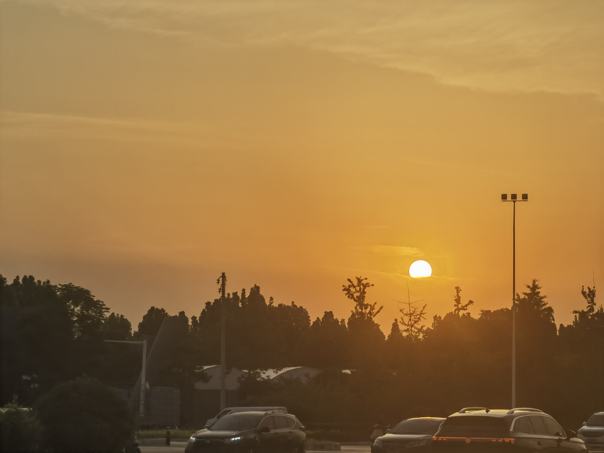](https://heyebei-my.sharepoint.com/:i:/g/personal/heyebei_heyebei_onmicrosoft_com/ESAJO2c37SxKkq_azPCDs-kBVXk_H7CT0_20DL6dAiyqmw?e=d3uDaA)

----

**2024年05月04日**    

人这一生，不是所有伤痛都需要呐喊，不是所有遗憾都会填满，你会发现痛苦的不是失去，而是回忆美好。    

[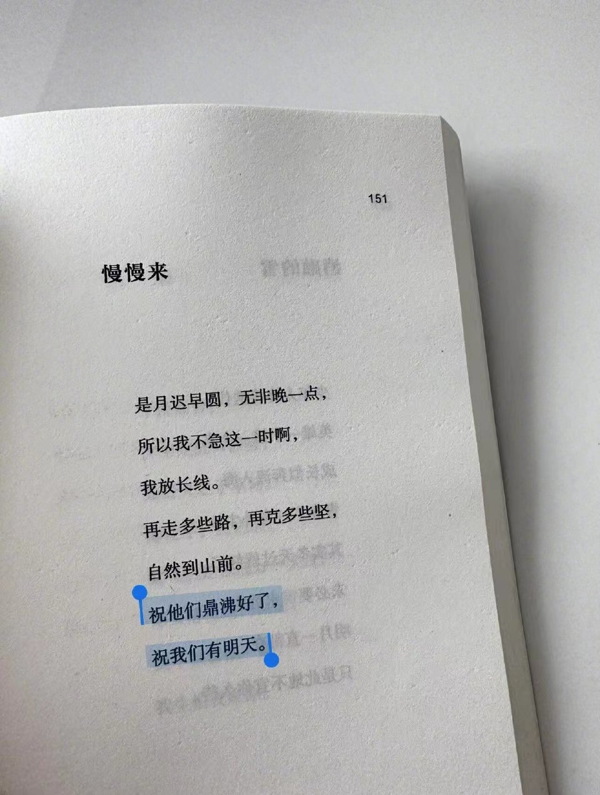](https://heyebei-my.sharepoint.com/:i:/g/personal/heyebei_heyebei_onmicrosoft_com/Eety7vBu32BPsGtCNKq6yvABQERSqgHPj1ww9GsU5gj1XQ?e=arCibV)

----

**2024年05月04日**    

图他的钱吗，好像不是，他并没有为你花多少钱。图他的人吗，好像也没有给你多少陪伴。图他的好吗，似乎他的好也并不只给你一个人。图他的爱吗，看不见也摸不着。既然什么都不图，那为什么不肯放手，因为你对自己的付出耿耿于怀。    

[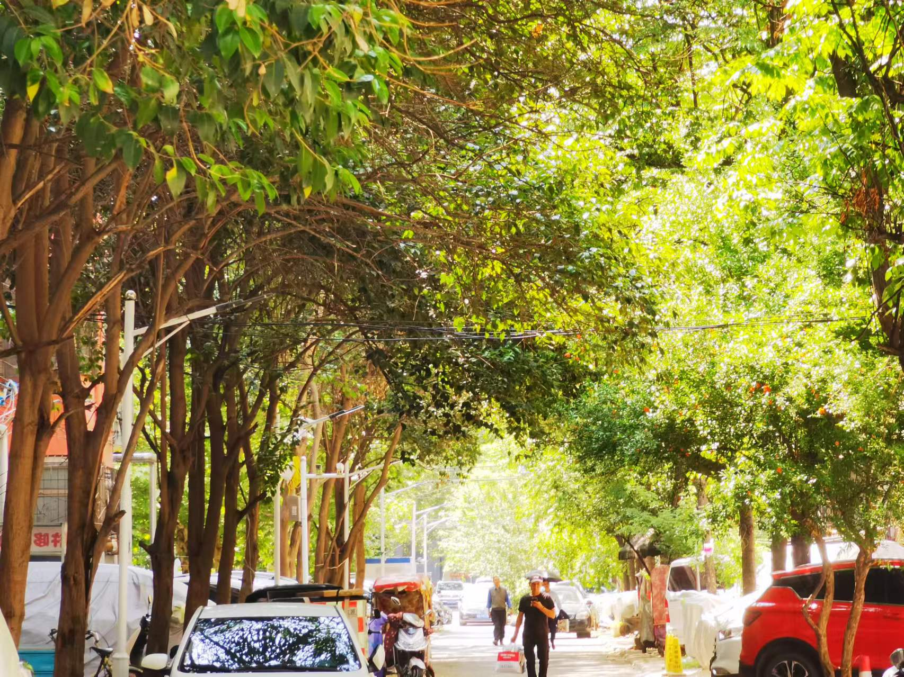](https://heyebei-my.sharepoint.com/:i:/g/personal/heyebei_heyebei_onmicrosoft_com/EU8-1qG-r7pEiXhSP1FfQ2kBv_xc-BtwNSkDgkHhrc67Fg?e=IAjHHR)

----

**2024年05月04日**    

爱上没什么了不起   
爱下去才了不起！     

[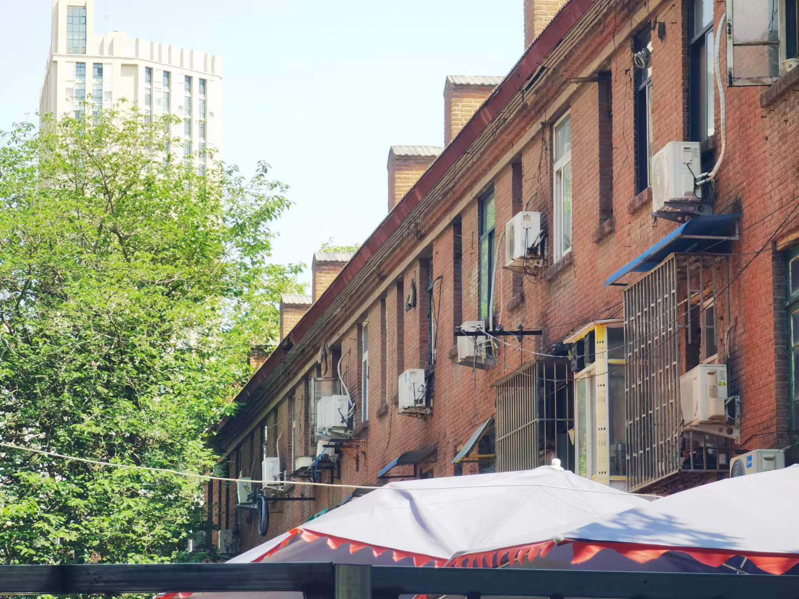](https://heyebei-my.sharepoint.com/:i:/g/personal/heyebei_heyebei_onmicrosoft_com/EQrADmLKt51PqwhS_m4ymOcBOFKjNb8ZbstkftYt4OMkPw?e=gLBjsj)

----

**2024年05月04日**    

不知道你们信不信，谈恋爱就一场积德   
那些过度消耗别人爱意的人，最终是得不到幸福的   
感情其实是有轮回的，对方用怎么样的方式去对你，就一定会有个人用同样的方式来对他   
而我们需要反省的应该是自己的眼光和见识，而不是怀疑自己的真诚和善良   

[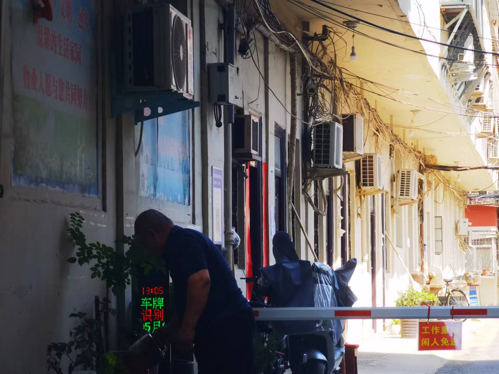](https://heyebei-my.sharepoint.com/:i:/g/personal/heyebei_heyebei_onmicrosoft_com/EWUtVMjkthRLmVRfzrXVpVsBFuMP8GaZrz9l9ubw-OeUNg?e=pWF6Iy)

---
**2024年05月05日**   

决定放下这一刻我还是舍不得   
但是我不能阻挡你进步的脚步   
你得一直往前走    
我也得变得优秀，而不是一直在我们的感情里内耗不是嘛？   
祝你前程似锦，若不能，便祝你万事如意    

[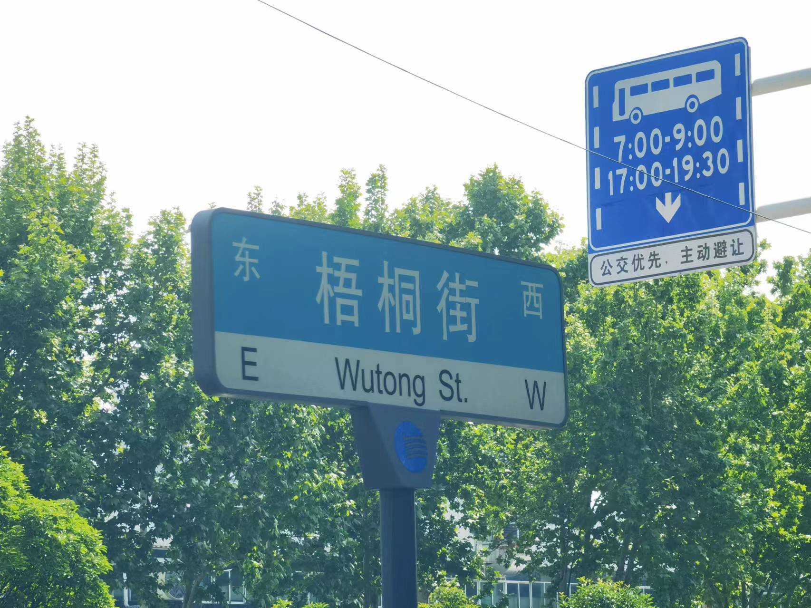](https://heyebei-my.sharepoint.com/:i:/g/personal/heyebei_heyebei_onmicrosoft_com/ETfFZ-1A0DNNtuni0rPmz5kBXnhwsnZodxF3KtlsKcRv-g?e=Uld8rv)

----

**2024年05月10日**   

电影里的遗憾都会有解释和结局     
可是生活不是电影    
遗憾也只会是遗憾    

[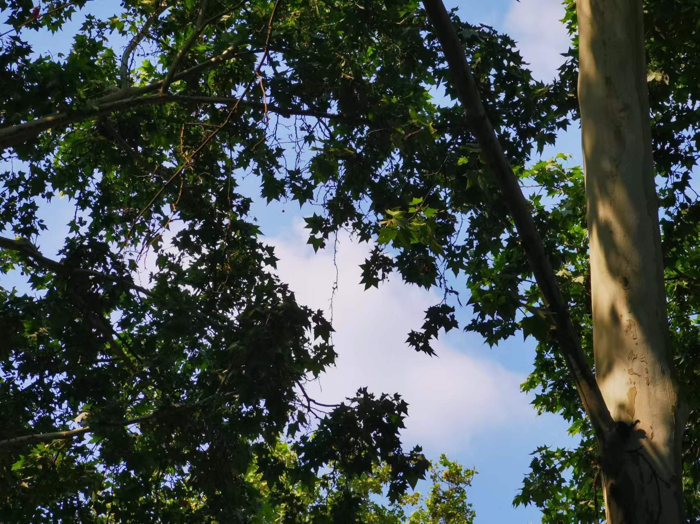](https://heyebei-my.sharepoint.com/:i:/g/personal/heyebei_heyebei_onmicrosoft_com/ES9TqKsEN8BLpi3VBpOPB6UBE2bFfiXholKIQug3I1bgRw?e=TYO8h6)

----

**2024年05月10日**    

<!DOCTYPE html>
 
爱情不靠猜测，太沉默怎知你爱我
 
 

[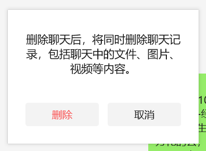](https://heyebei-my.sharepoint.com/:i:/g/personal/heyebei_heyebei_onmicrosoft_com/Efa7fk1pAcFCu-8kSFlM8JwBh90iFRYAKzE5Nowlr9sAqQ?e=BaXKji)

----
**2024年05月11日**   

学会放弃其实是一件挺厉害的事。放弃一段耗人的关系，放弃某个不甘心的执念，放弃努力了也得不到的东西，放弃不切实际的幻想，放弃紧握着不撒手的过去。放弃这个词听上去挺丧的，但你想一想这又何尝不是新的开始呢，它意味着你将收获新的东西。    

[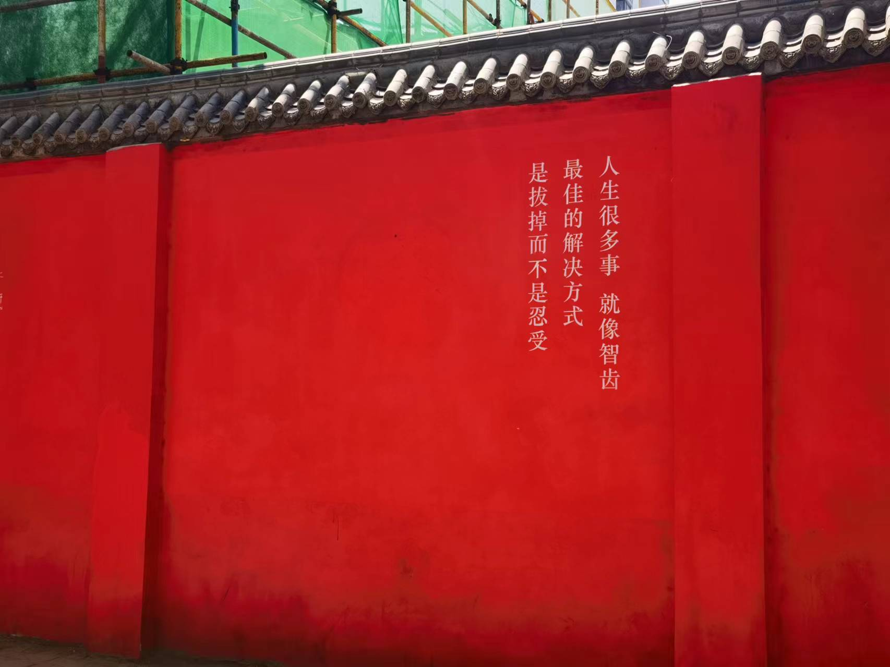](https://heyebei-my.sharepoint.com/:i:/g/personal/heyebei_heyebei_onmicrosoft_com/EXtKZiT-7t1Lh2T5CtEfgBsB9UU5NhIqvD_ZJO36SK7BCw?e=f7IcXN)

----

**2024年05月12日**    

一夜无眠，一夜梦境轮转    
梦中出现太多人，太多事   
小时的玩伴，近期的旧人   
我时常在想，为什么会有回忆   
可能是遗憾吧，可能是执念吧   
到底是谁在给回忆造记忆   

[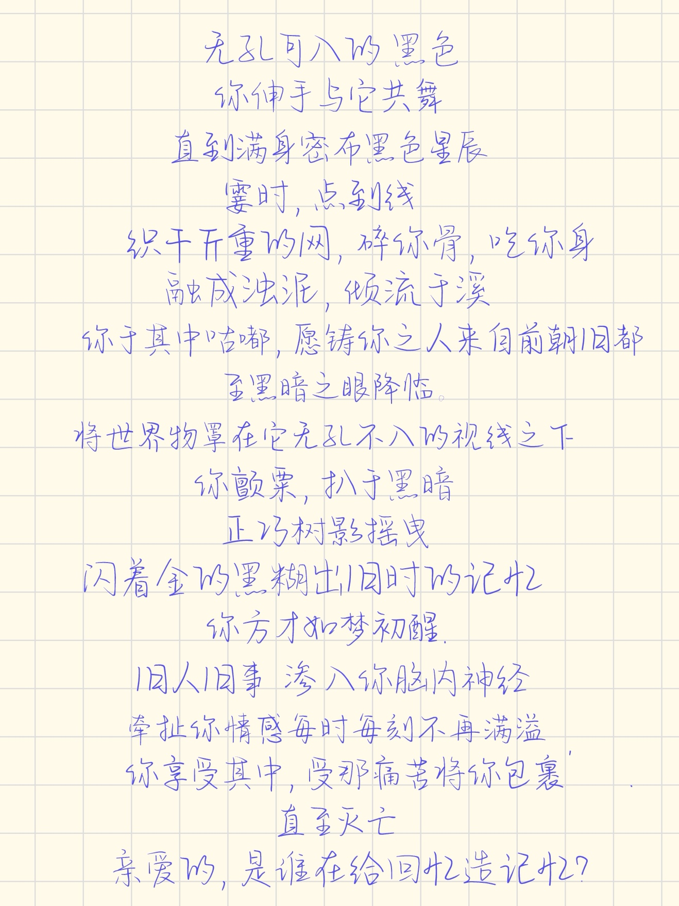](https://heyebei-my.sharepoint.com/:i:/g/personal/heyebei_heyebei_onmicrosoft_com/EXZN_wyyaHtJk0JB4YuNkDUB_rmgrvx8vGV5sNpiFswK1Q?e=nZ4aMF)

----

**2024年05月13日**   

如果有一天，有人给了我足够的心安   
足够的偏爱，足够的安全感   
我若跟他走了，不要怪我   
因为我也问你要过   
只是你觉得我不配拥有     

----

**2024年05月13日**   

有人察觉到你今天的不开心，想尽法子来逗你笑，一次次把支离破碎的你拼好，总是笑盈盈的稳定你的情绪，像小太阳一样照亮你    
而有的人却说你喜欢无理取闹，喜欢发脾气，一直在指责你，看吧这就是区别   
说我爱你很容易，买一次两次东西也很容易，接吻很容易，拥抱很容易，但在面对你一次又一次的负面情绪的时候，不是不耐烦，不是指责，是很难的，就像你皱眉的时候，我只会觉得心疼，总觉得这个世界给你的不够     

[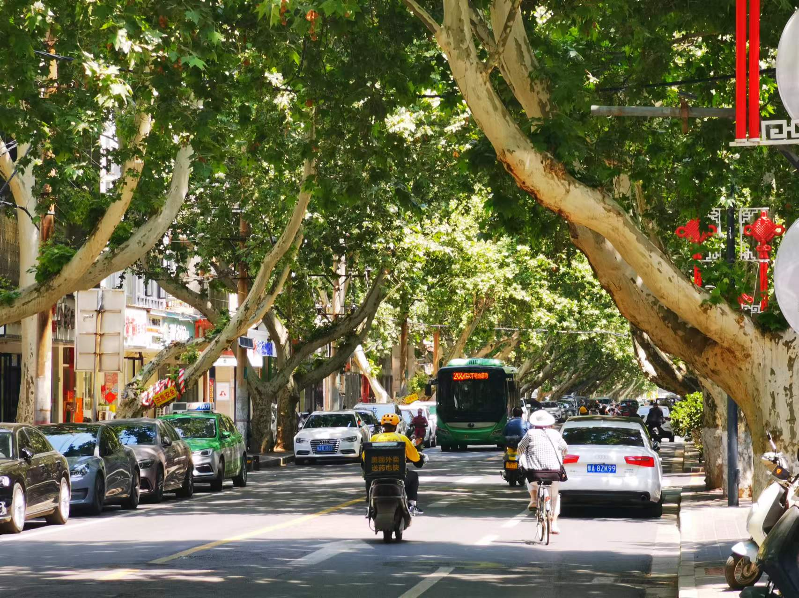](https://heyebei-my.sharepoint.com/:i:/g/personal/heyebei_heyebei_onmicrosoft_com/EWTDJ7403IVDh3YeU4l8tXEBezMHB42UrAL_caX2I6t6_g?e=HePpRe)

----

**2024年05月13日**    

而今    
到了小时候最羡慕的年纪    
却没有成为那时候最想成为的人    
少年不再是当年年少   
我亦不是此间少年   
 
[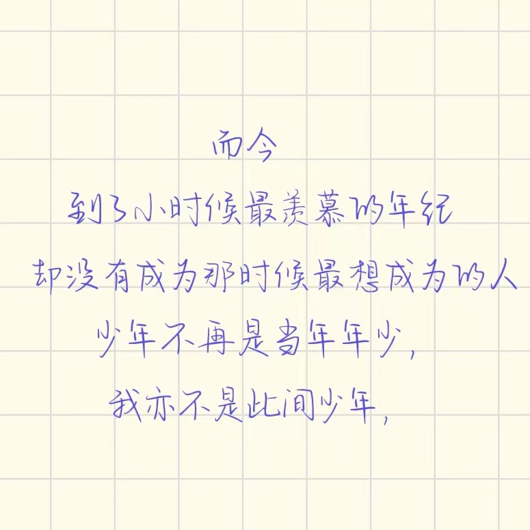](https://heyebei-my.sharepoint.com/:i:/g/personal/heyebei_heyebei_onmicrosoft_com/EU6fxWL-ekpJqyGmv6qUYu4B2JkSijchyhZxU3TVN--C1A?e=NTUhwt)

----

**2024年05月14日**    

晚风微凉，我采了一朵路边的花。许多年以后，人们会说陈年旧事可以被埋葬了，但我依然想说:愿我们都能在年轻的时候如愿！！ 

[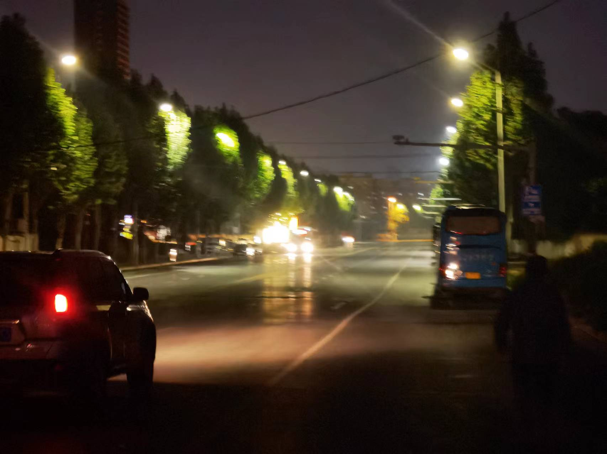](https://heyebei-my.sharepoint.com/:i:/g/personal/heyebei_heyebei_onmicrosoft_com/EYs51kBcrDFAmjx83VPUxUEBUGrinx32ORxcQVMQxzuqhA?e=lxgnB4)     

----

**2024年05月14日**    

小时候看刻舟求剑的故事，觉得那个人好傻，他难道不知道剑在江中央掉下了水，跑到江边是找不到的？     
长大后才明白，在时间的长河里，不知道多少人一次次的返回某个节点，想寻找某个失去的东西，但是只能站在船边徘徊     
失去的东西永远不会再回来，因为你已经不是曾经的你了，故地重游，本就是刻舟求剑     

[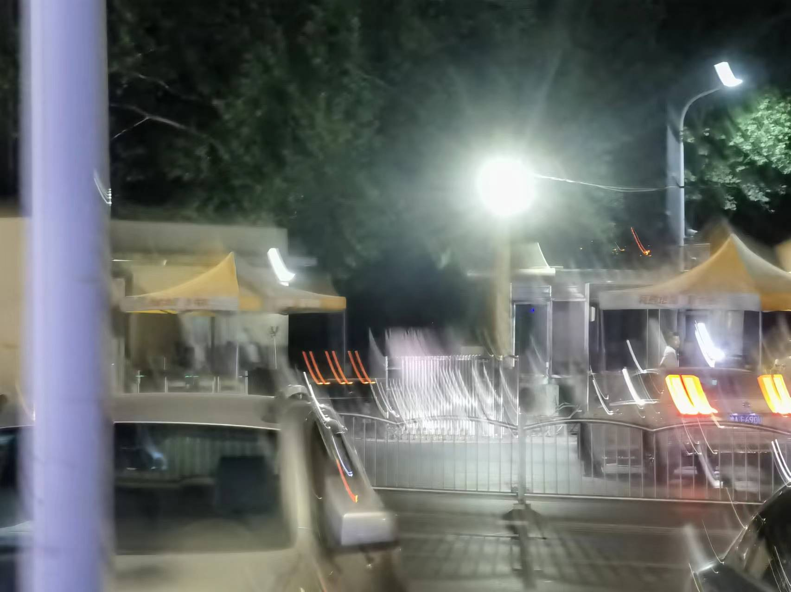](https://heyebei-my.sharepoint.com/:i:/g/personal/heyebei_heyebei_onmicrosoft_com/EbFmjAWw4S1Ojo0FLKJbU2cBA7rBmtoACbDC0mFMwlsttQ?e=9dHRUT)

----

**2024年05月15日**    

是否在梦里，我们都会更开心     

[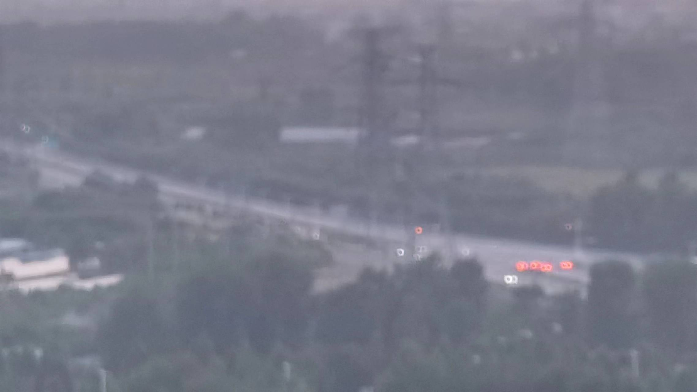](https://heyebei-my.sharepoint.com/:i:/g/personal/heyebei_heyebei_onmicrosoft_com/Ebt_CF1SZkRHqg9VyCn01FoBJQ6Erlwnh_VZg-xI2M0DGQ?e=imiPwD)

----

**2024年05月15日**    

回忆闪了一帧，你我又见了一面    

[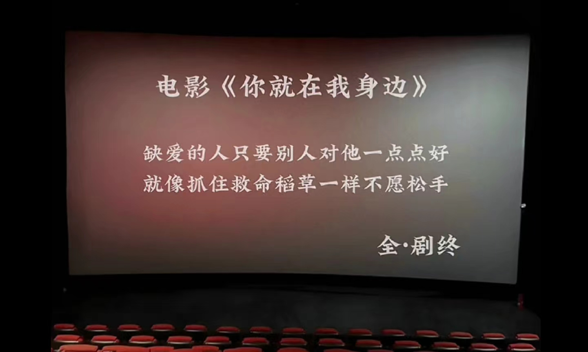](https://heyebei-my.sharepoint.com/:i:/g/personal/heyebei_heyebei_onmicrosoft_com/EW8TJiyuucpIgzVHqTIp1KIBTqIdjR0kFTdNFi11jKbIeA?e=7gZucs)

----

**2024年05月16日**   

我的躯体化症状并没有得到更好的处理，而是适应了一切，能够更好的隐藏了，偶尔的治愈也越来越少。我摔了一跤，太痛了，但我早已不会表达了。我坐了起来，就这样坐着，一个又一个的春夏秋冬，便再也站不起来了。    

[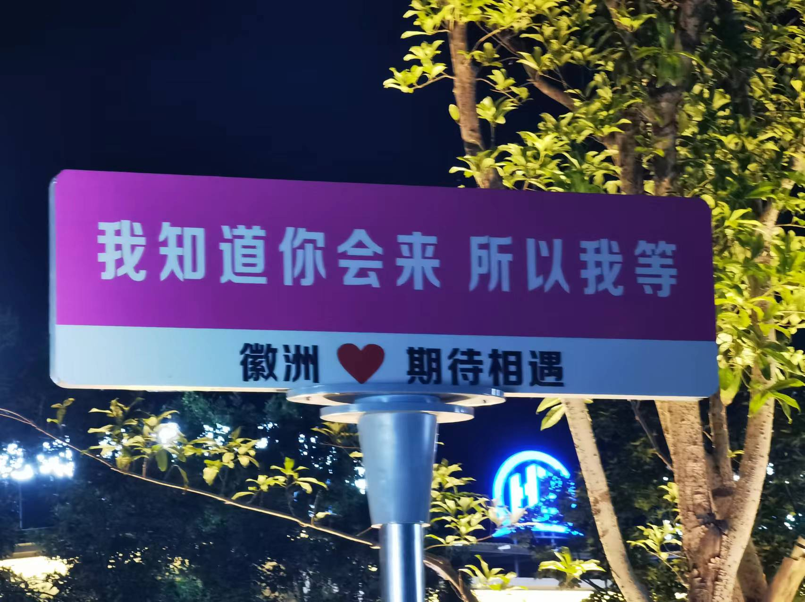](https://heyebei-my.sharepoint.com/:i:/g/personal/heyebei_heyebei_onmicrosoft_com/EZUruB4RLclGtumo_9ZM4BgB0H6G_-1BU1AXUMhTVtshxQ?e=yW60FM)

----

**2024年05月16日**   

小时候看电视剧 总觉得男女主很多误会 都没必要存在 他们闹矛盾的时候 心里总在想 你们快讲明白啊 说个话都那么墨迹 为什么不早点表达自己的需求和感受 拖好久才说出那句真心话 后来我才明白 有些话真的很难说出口 身临其境时 我甚至比他们还沉默    

[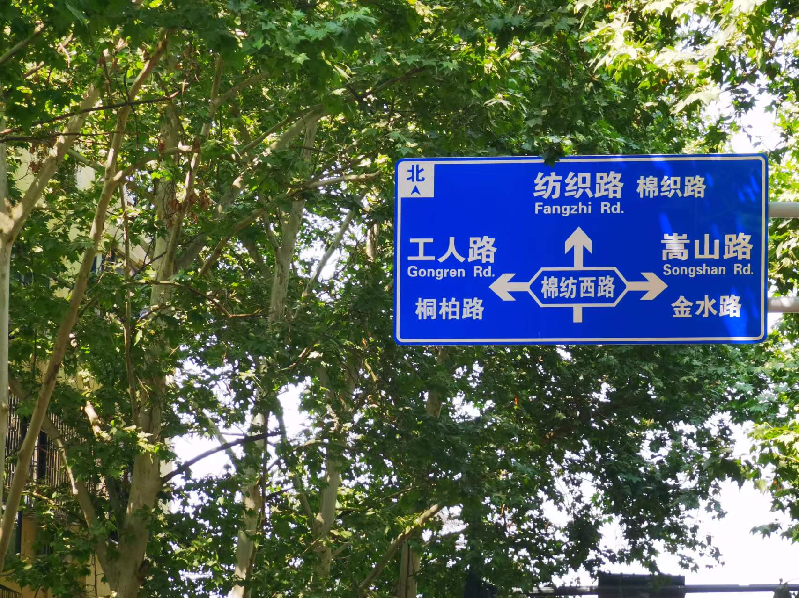](https://heyebei-my.sharepoint.com/:i:/g/personal/heyebei_heyebei_onmicrosoft_com/EZh_NSxISNdBnVeQ18y6Y3ABOgXSwUgfwJ0-7AL5r9-4ug?e=PziHDd)

----

**2024年05月19日**    

我从不后悔自己付出真心，也从不计较是否得到回应。但我开始害怕，在时间里失去的，会让以后的自己嘲笑现在的自己太蠢。我从不质疑真心，但真心瞬息万变，爱这个东西，山高路远，全凭良心，而良心，爱的时候有，不爱的时候连渣都不剩。    

[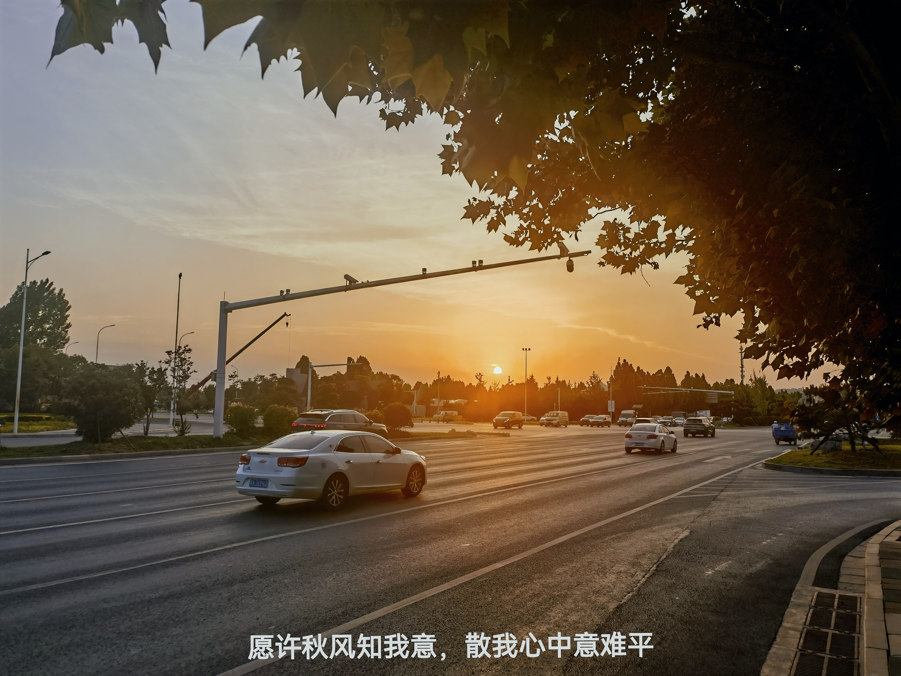](https://heyebei-my.sharepoint.com/:i:/g/personal/heyebei_heyebei_onmicrosoft_com/ESbs6UQXno9LgAr-PMd0_pIBx543NAoYzX9CyuQKceHWkw?e=ehcsUe)

----

**2024年05月20日**    

生命本就是一条悲伤的河流，因为害怕溺亡，所以才想找人同游。    
可惜前往彼岸的路太长了，水中清梦，总是让人看清万物虚构。    

----

**2024年05月22日**     

我不擅长维护一段关系，经过长久的相处，我发现真正好的关系不需要特意维护。特别喜欢一段话人家:撇下你的那一刻，一定是觉得没有你的生活会更好或者有没有你，生活都没有任何变化。所以任何一段关系都需要双方的努力才行，友情爱情都一样。一个重视你的人永远不会把自己置身于可能失去你的境地，我始终认为，人对重要的事物是不会随意对待的。在大多时候，你所感受到的冷漠，忽视，不在意都不是错觉，你要相信自己的直觉。      

[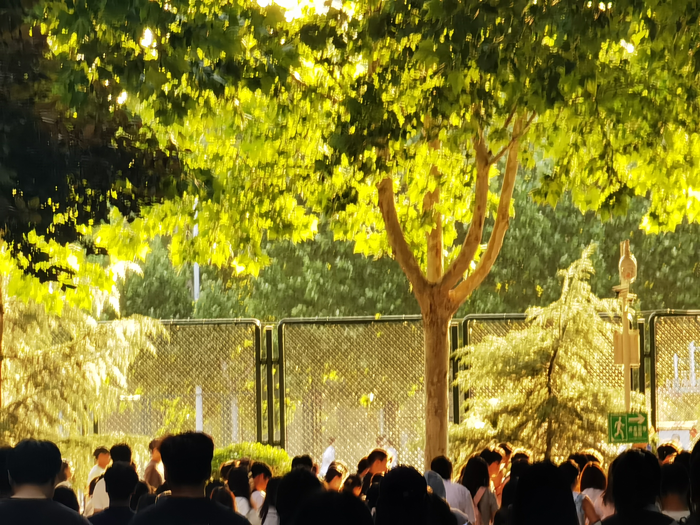](https://heyebei-my.sharepoint.com/:i:/g/personal/heyebei_heyebei_onmicrosoft_com/EaQgKrmQU0hGtCNxAct7v4UB6V3UPB5J5zU8yf4tFEPc4A?e=2YH1fW)

----

**2024年05月23日**    

人生的路很长，没有必要事事清楚，件件明白。所谓遗憾、错过也是成长，那些爱而不得、求而不得的，都会是你前进路上的光亮。    

[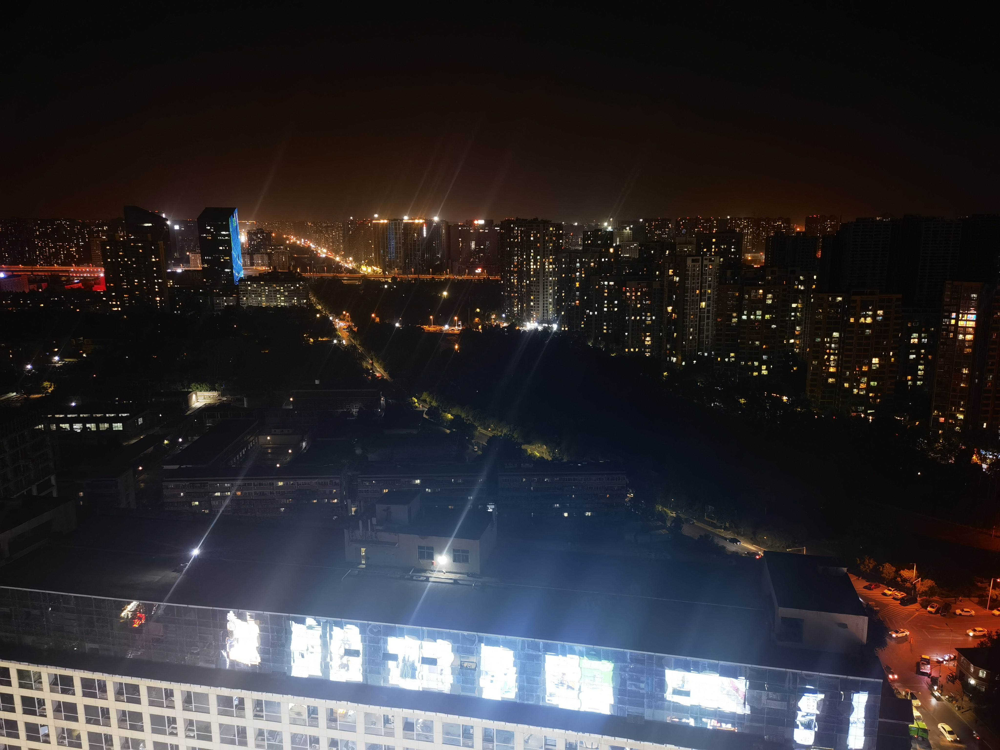](https://heyebei-my.sharepoint.com/:i:/g/personal/heyebei_heyebei_onmicrosoft_com/ETbG7uWnZuNAjSQmBayvPrQBhfrqYAqGpjv3EIamFGpzyw?e=zFYDQx)

----

**2024年05月24日**    

人总要和自己和解，在我们存在于仅此一次的当下，行己所爱，爱己所行。     

----

**2024年05月27日**    

花开便有花落，爱也是。爱与被爱，都有开始和结束，勇敢的人愿意承担风险。爱与被爱都别低头，这是最大的勇敢！    

[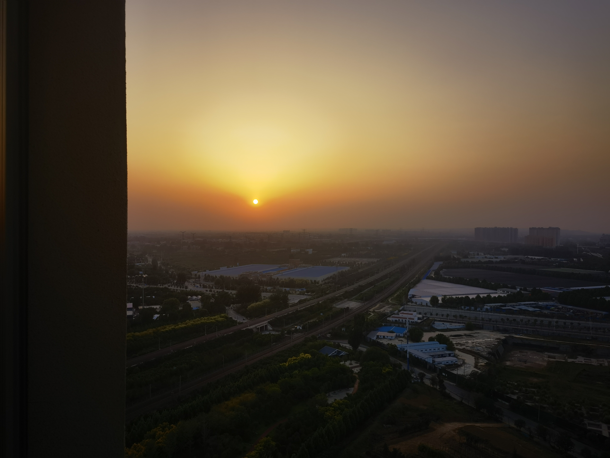](https://heyebei-my.sharepoint.com/:i:/g/personal/heyebei_heyebei_onmicrosoft_com/EeSPgVIcxFZFt4EnnvnQhX0BqRxtosNO6yhq3h7IJJcczQ?e=c3widv)

----

**2024年05月27日**     

如果你对一个人太上头
其实是你自己出了问题
你太渴望一段感情  太渴望被爱
而这时他刚好出现
他所有的好
不过是你给他的光环和滤镜
而不是他本身有多好
他到底哪里好
你喜欢他身上哪些特质
其实你自己也说不出来
所以你原来爱的不过是一种幻想
你不是多喜欢这个人
而是太孤独了  太想要一个人陪伴
少去纠结你是不是不够好看
是不是性格不够好  没有别人优秀
不爱是常态 被爱是偶然
人的相互喜欢有很多原因
就像青椒我从小就不喜欢吃
可是还是有很多人一直喜欢吃
萝卜青菜各有所爱
所以停止否定自己
谁喜欢你呢就对谁好
遇事先考虑自己开不开心
但凡让你情绪低落的人或者事出现
就不要让他再走进你的世界
真诚这张牌 单出就是送命
真诚需要遇到同样真诚的人

[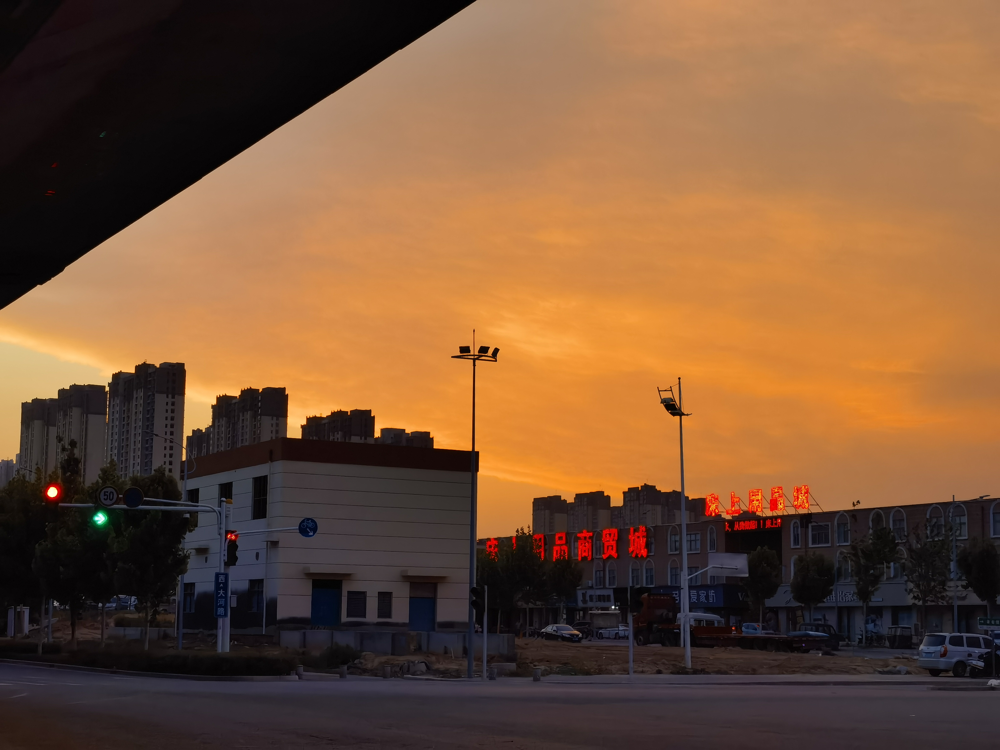](https://heyebei-my.sharepoint.com/:i:/g/personal/heyebei_heyebei_onmicrosoft_com/ESjH4hXVDwJPtVyMAc5jaPgBlfyp1hgqeZiK1n0o4TSUKQ?e=4EWmYO)

[破窗效应-20240526](https://heyebei-my.sharepoint.com/:v:/g/personal/heyebei_heyebei_onmicrosoft_com/EawzSkGaZs9Aqt1wLX1S0QsBAOxvGvzgVkldsERLhDYo_g?e=FVpUNJ)
----
**2024年05月29日**    

这个世界上最恶心的一句话是，事情都过去了，你怎么老揪着过去不放。有些事你过去了，但我过不去，因为被迫吞下委屈的是我，而不是你。道理谁都能讲，但并不是讲道理的人都是对的人。    

[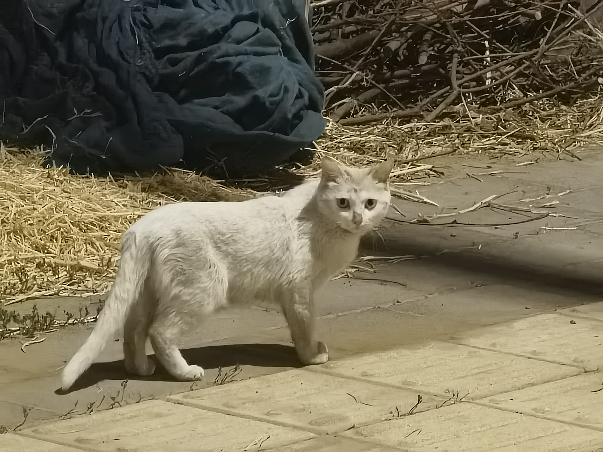](https://heyebei-my.sharepoint.com/:i:/g/personal/heyebei_heyebei_onmicrosoft_com/EQnRpsHVWiROjZBE06wXL3oBvLyXuEM4XQ-LadHtbTZCzQ?e=Hpe9no)

----

**2024年05月30日**    

我偏要在这个快餐式恋爱的时代，用真心砸出真心    
——记与小张同学相遇    

[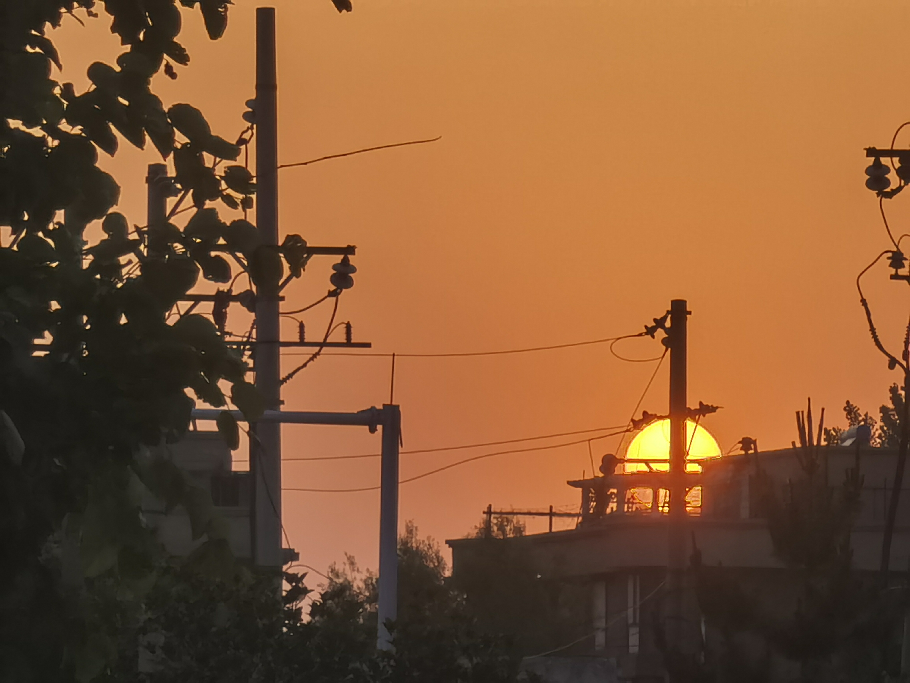](https://heyebei-my.sharepoint.com/:i:/g/personal/heyebei_heyebei_onmicrosoft_com/EfDchqMbJUdGlkEo2D6o7-kBdBGN81xPnafrLEE-IGr6cA?e=eVZRhp)

----

**2024年05月31日**       

“我将于茫茫人海中寻找我灵魂的唯一伴侣，得之我幸，不得我命。”    

----

**2024年06月01日**    

一个温暖的人，是因为有另一个温暖的怀抱    

----

**2024年06月02日**    

时光匆匆，总有人后悔，他们总是说如果能够回到过去，可我从不后悔。我爱当下！那些胆小脆弱，那些惊慌恐惧，以及那些依然保留的柔软善良，我都不想重来。    

[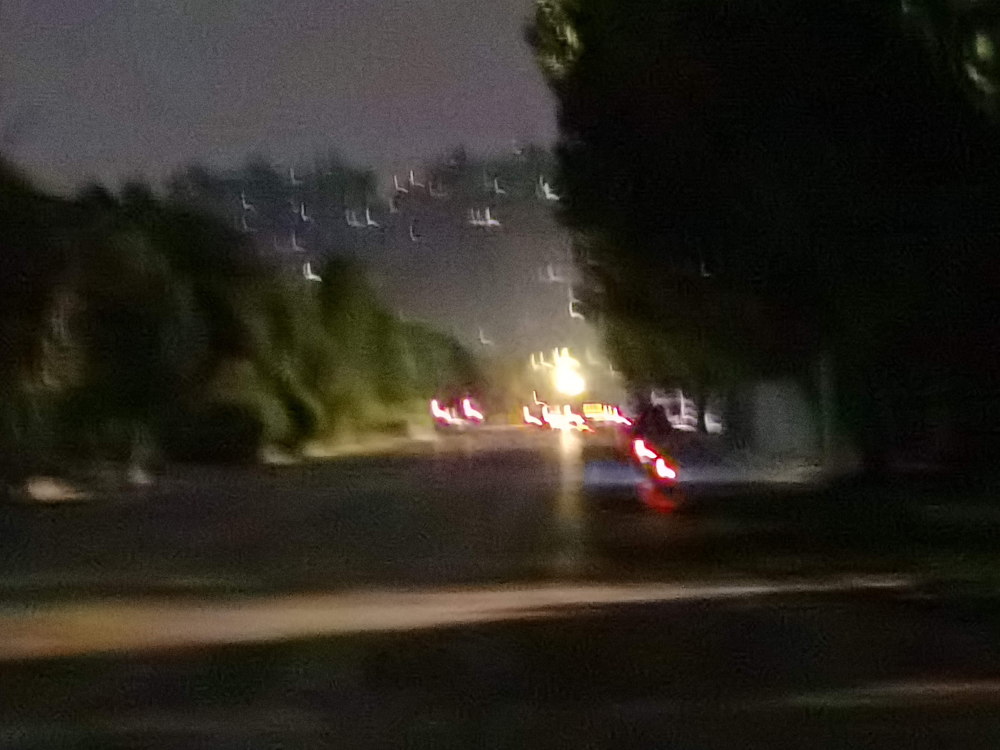](https://heyebei-my.sharepoint.com/:i:/g/personal/heyebei_heyebei_onmicrosoft_com/EU2GD0YeSuRNv6L3gtTRWckBridxXXOx0iWHv4_AV7eqYg?e=VOHV5P)

----

**2024年06月04日**    

我相信这个世界上有着朴素的、单纯的、真诚美好的爱，但我从不觉得自己是一个幸运的人。     
可若真的有一天有幸，能让我捡到那一束光，纵使终会归还给太阳，我也会紧紧抓住。    
所以做一个勇敢的人！本自具足，莫向外求！

----

**2024年06月04日**    

我怕爱人
畏惧于他的锋芒 隐没在他的身旁
我怕爱人
我怕爱上的是他的皮肉
我怕爱上的是他的一时风华
我怕爱上的是一个我对于另一个我的怜悯
我总是想
会不会浪费对方的年华
会不会太过儿戏
总是设身处地的为对方考虑
说白了
我怕爱自己
我们都是感情里的怯懦者
当我们无法学会爱自己
就无法开始爱别人

[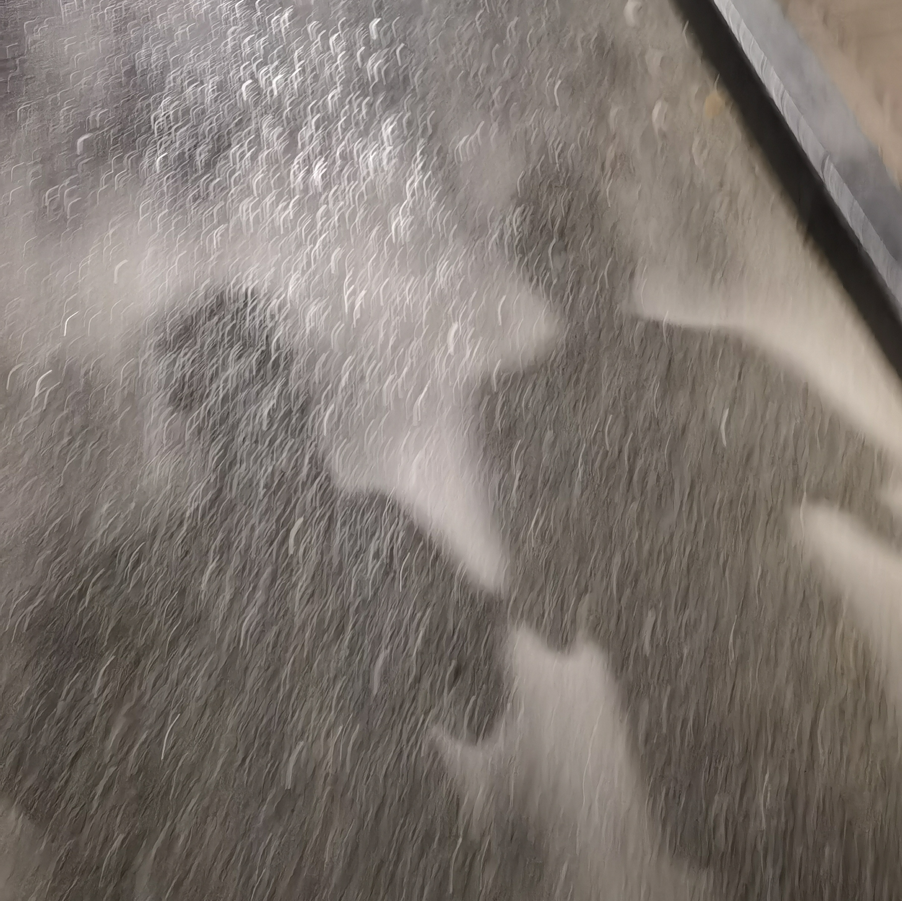](https://heyebei-my.sharepoint.com/:i:/g/personal/heyebei_heyebei_onmicrosoft_com/ESwWIkqmvitPnww7Q-rBqrsBjV7m12nw5O9XJKHCmjRyiA?e=Yi0e6K)

----

**2024年06月06日**   

两两无言时，因为我的纠缠要你平衡那么多事，突然心疼你，我想你永远开心、永远明媚。当你开心，要我们没有交集才可以，那么我很庆幸还能在最后为你做点事。落日晚风尽头，你！永远自由！    

[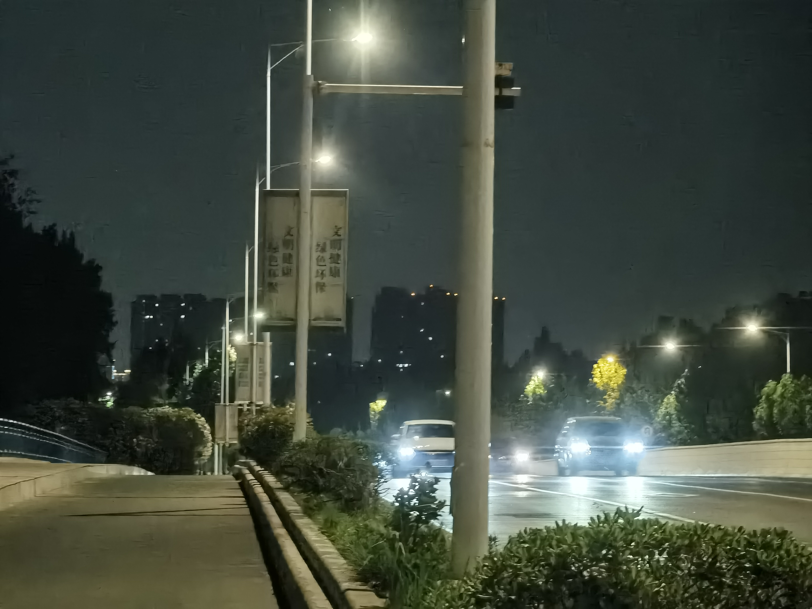](https://heyebei-my.sharepoint.com/:i:/g/personal/heyebei_heyebei_onmicrosoft_com/ERFHbDBV7z9NpDoAR25u6YUB1010J7hSv-EbTE2oK3gOUA?e=kNXLE0)

----

**2024年06月06日**    

有时候我会经常在想，像我这样的人真的会有一个人，翻山越海而来，然后用真心来爱我吗？可能吧。    
可是我也清醒的知道，从小到大好像从来没有什么东西真正属于我，也从来没有人坚定的选择过我。    
所以任何一个人哪怕给我一点真心我也会想要用尽全力的把他留在我身边，我会千倍百倍的想要对他好。可是，我也忘了，我的这些好对于对方来说也许只是一种负担。    

[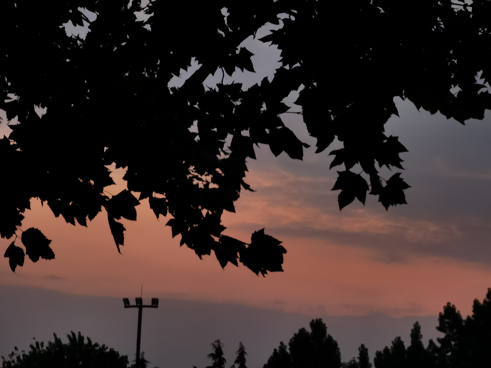](https://heyebei-my.sharepoint.com/:i:/g/personal/heyebei_heyebei_onmicrosoft_com/EVVMxqqHSZBBgF1Go_EnPHgBuZ1_8HgOMcT0wAB8zWGg4Q?e=e1U5fR)

----

**2024年06月07日**    

这一路的艰辛只为了能见上你一面    
可这一路的艰辛在见到你的那一刻就觉得不算什么了    
因为爱 因为你 所以这一切都值得    
去的时候一路上都在期待   
可返程的路上只有孤独   
爱这段路聚少离多   
山高路远全凭良心

----